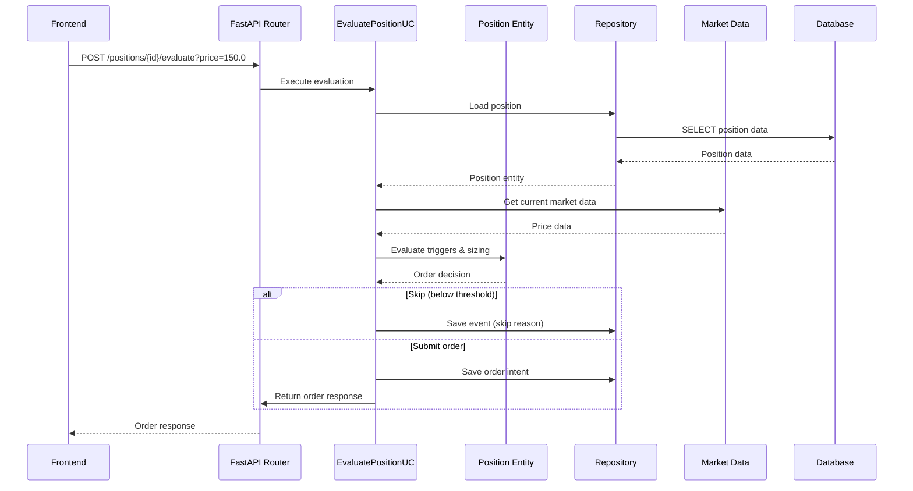
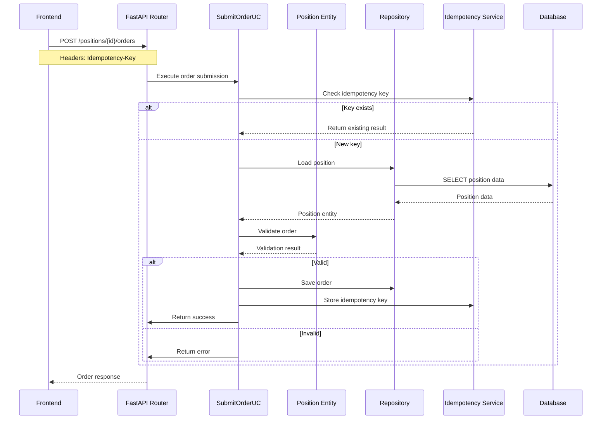
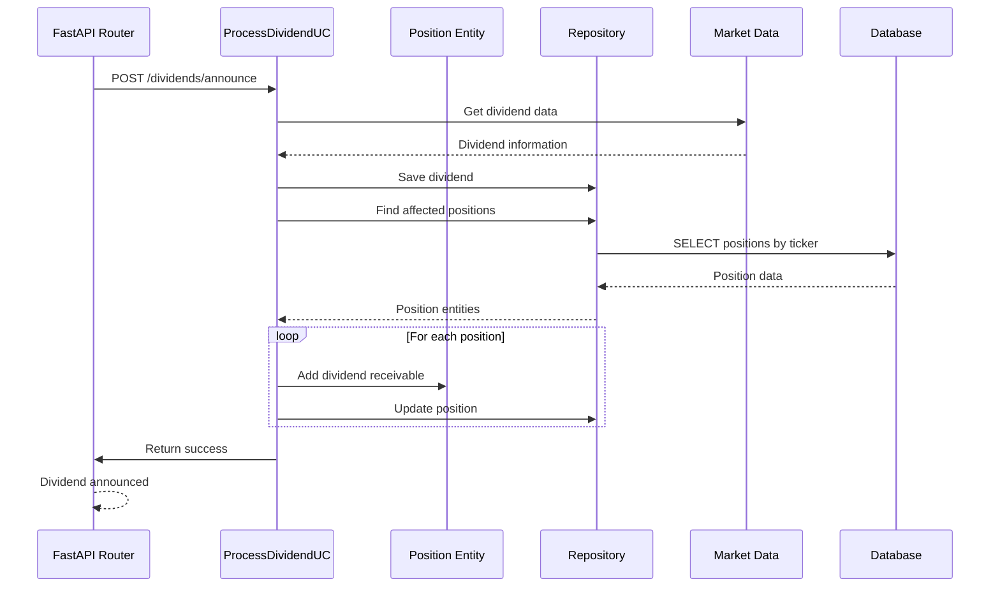
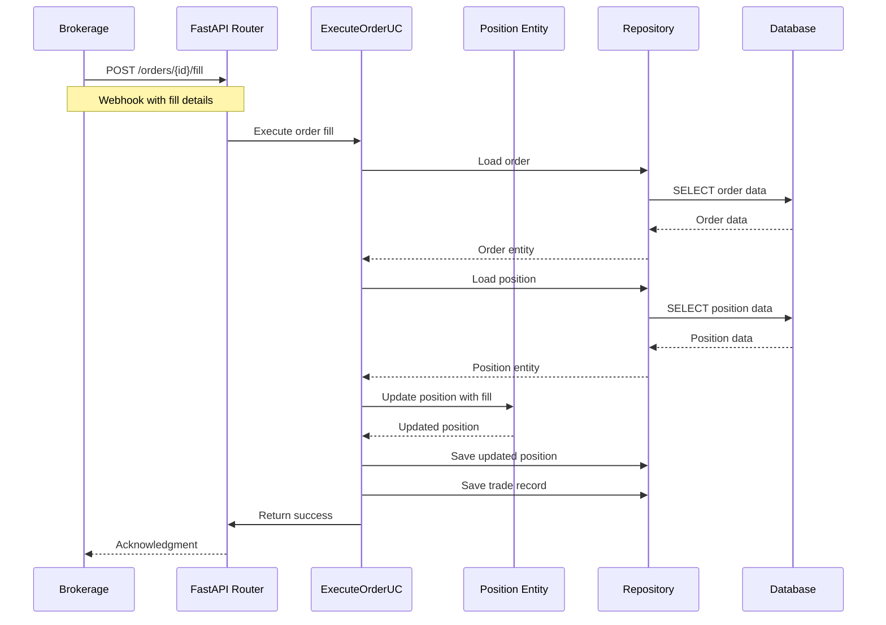
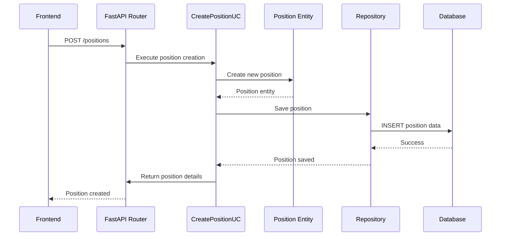
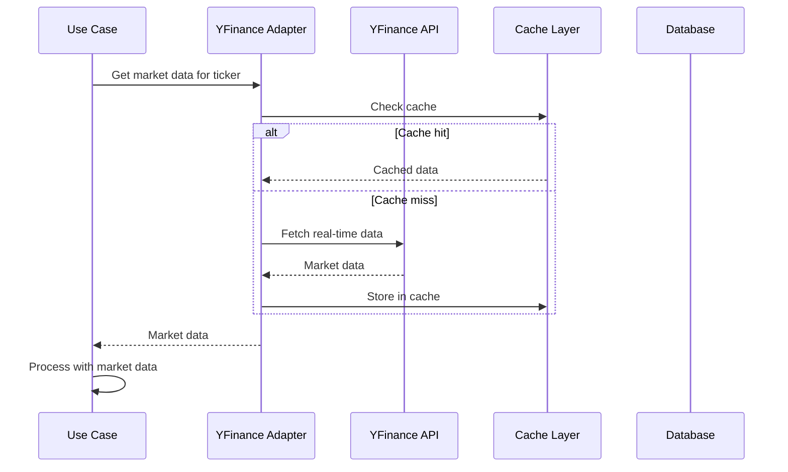
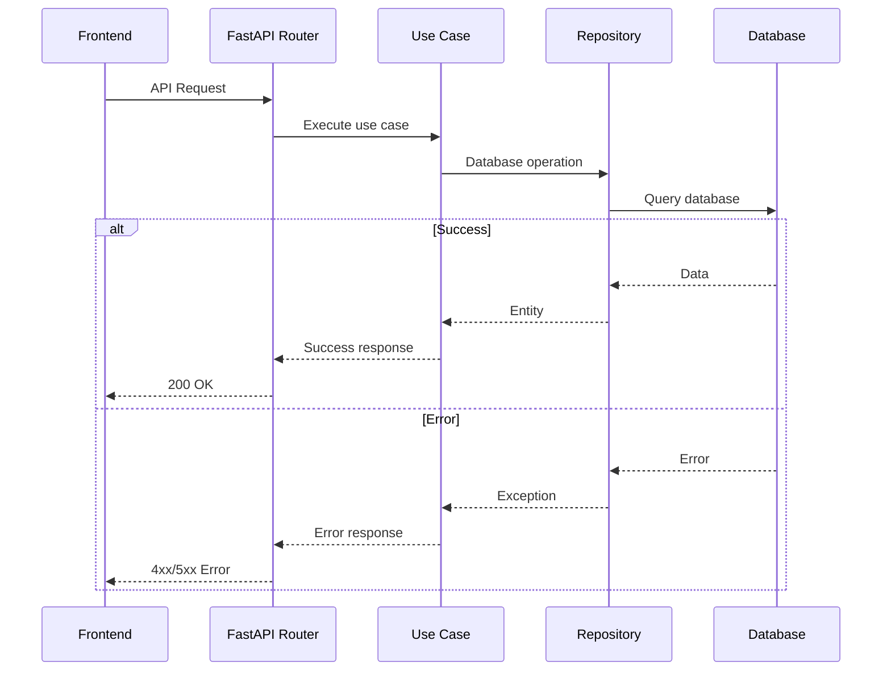

# Sequence Examples (Mermaid)

This document contains comprehensive sequence diagrams for the Volatility Balancing system.

## Position Evaluation Flow

## Order Submission Flow

## Dividend Processing Flow

## Order Filling Flow (Broker Callback)

## Position Creation Flow

## Market Data Integration Flow

## Error Handling Flow

