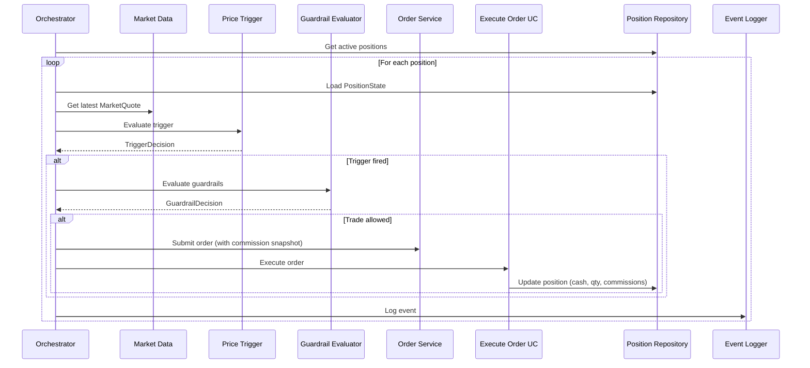

# Volatility Balancing – Architecture Overview

## Vision

Empower investors to achieve stable, long-term growth through algorithmic trading on blue-chip equities, bridging the gap between passive investing and active management and inspiring confidence in data-driven, low-risk wealth creation.

## Mission

Build and continuously improve a semi-passive trading platform that systematically identifies and exploits mean-reversion opportunities in blue-chip stocks, executes trades based on volatility oscillations around trend lines, and enforces dynamic risk controls — delivering consistent returns above market benchmarks while protecting capital.

---

## 1. System Purpose

Volatility Balancing is a rules-based, event-driven rebalancing engine designed to manage a portfolio through disciplined responses to volatility. Instead of predicting markets, the system continuously reacts to price deviations, restores balance toward a target allocation, and enforces strict guardrails that limit risk and protect capital.

The architecture supports both automated trading and advanced analytics, while remaining transparent, auditable, and easy to extend.

---

## 2. High-Level Architecture

The platform is built as a set of modular services connected by asynchronous event pipelines. Each service performs a single responsibility, and no service depends on another via direct calls. This ensures scalability, resilience, and clean separation of concerns.

### 2.1 Clean Architecture Layers

The system implements a **Clean Architecture** (Hexagonal Architecture) with three main layers:

#### Domain Layer (`backend/domain/`)

**Pure business logic. No HTTP, no DB, no external APIs.**

- **Value Objects**: `MarketQuote`, `PositionState`, `TriggerConfig`, `GuardrailConfig`, `TriggerDecision`, `GuardrailDecision`, `TradeIntent`
- **Domain Services**:
  - `PriceTrigger.evaluate()` - Pure function to evaluate price triggers
  - `GuardrailEvaluator.evaluate()` - Pure function to evaluate guardrail constraints
- **Entities**: `Position`, `Order`, `Trade`, `Dividend` (with commission/dividend aggregates)

#### Application Layer (`backend/application/`)

**Orchestration and use cases. Depends on domain, not infrastructure.**

- **Orchestrators**:
  - `LiveTradingOrchestrator` - Manages live trading cycles
  - `SimulationOrchestrator` - Manages simulation runs
- **Use Cases**:
  - `EvaluatePositionUC` - Evaluates positions for triggers
  - `SubmitOrderUC` - Submits orders with commission snapshots
  - `ExecuteOrderUC` - Executes orders and updates positions
  - `ProcessDividendUC` - Processes dividend payments
- **Ports** (Interfaces):
  - `IMarketDataProvider`, `IHistoricalPriceProvider`
  - `IOrderService`, `ISimulationOrderService`
  - `IPositionRepository`, `ISimulationPositionRepository`
  - `IEventLogger`

#### Infrastructure Layer (`backend/infrastructure/`)

**Concrete implementations. Can be swapped without affecting business logic.**

- **Adapters**: Implement application ports (YFinance, SQL repositories, etc.)
- **Repositories**: SQL, Memory implementations
- **Config Store**: Commission rate management (`ConfigRepo`)
- **External Services**: Market data providers, broker APIs

**Key Design**: Live trading and simulation share the same domain logic (`PriceTrigger`, `GuardrailEvaluator`), with differences only in orchestrators and adapters.

**See**: [Clean Architecture Overview](clean_architecture_overview.md) for detailed implementation.

### 2.2 Core Event Flow

The system follows an event-driven architecture where services communicate through events. Below is the conceptual flow, with the actual implementation mapping shown in section 2.3.

#### Conceptual Services (Event-Driven Model)

**PriceFetcher** (Conceptual)

- Ingests market data
- Emits `PriceEvent`
- **Implementation**: `IMarketDataProvider` adapter (YFinance)

**VolatilitySignalService** (Conceptual)

- Evaluates price changes versus strategy thresholds
- Emits `TriggerEvent`
- **Implementation**: `PriceTrigger` domain service + `EvaluatePositionUC`

**AllocationGuardrailService** (Conceptual)

- Checks risk and allocation limits
- Emits `GuardrailEvent`
- **Implementation**: `GuardrailEvaluator` domain service

**RebalanceOrderService** (Conceptual)

- Creates orders when allowed
- Embeds commission rate snapshot
- Emits `OrderEvent`
- **Implementation**: `SubmitOrderUC` use case

**ExecutionListener** (Conceptual)

- Records actual market fills
- Writes commissions
- Emits `ExecutionEvent`
- **Implementation**: `ExecuteOrderUC` use case

**PositionService** (Conceptual)

- Updates positions, cash, cost basis, commissions, dividends
- Emits `PositionUpdatedEvent`
- **Implementation**: `IPositionRepository` adapter + `ExecuteOrderUC`

**CorporateActionsService** (Conceptual)

- Processes dividends (ex-div, pay date)
- Emits `DividendPaidEvent`
- **Implementation**: `ProcessDividendUC` use case

**NotificationService** (Conceptual)

- Sends user notifications asynchronously
- **Implementation**: Future implementation (not yet built)

**AnalyticsService** (Conceptual)

- Generates KPIs, charts, and performance insights
- **Implementation**: `PortfolioService`, Excel export services

**SimulationService** (Conceptual)

- Replays historical events for strategy testing
- Read-only on production data; writes only to simulation tables
- **Implementation**: `SimulationOrchestrator` + `ISimulationOrderService`

### 2.3 Service Mapping: Conceptual vs. Implementation

| Conceptual Service         | Implementation Component                               | Layer                        |
| -------------------------- | ------------------------------------------------------ | ---------------------------- |
| PriceFetcher               | `IMarketDataProvider` (adapter)                        | Infrastructure               |
| VolatilitySignalService    | `PriceTrigger` (domain service) + `EvaluatePositionUC` | Domain + Application         |
| AllocationGuardrailService | `GuardrailEvaluator` (domain service)                  | Domain                       |
| RebalanceOrderService      | `SubmitOrderUC` (use case)                             | Application                  |
| ExecutionListener          | `ExecuteOrderUC` (use case)                            | Application                  |
| PositionService            | `IPositionRepository` (adapter) + `ExecuteOrderUC`     | Infrastructure + Application |
| CorporateActionsService    | `ProcessDividendUC` (use case)                         | Application                  |
| SimulationService          | `SimulationOrchestrator` + `ISimulationOrderService`   | Application + Infrastructure |

### 2.4 Financial Tracking Flow

**Commissions:**

1. Commission rate fetched from `ConfigRepo` (global → tenant → asset hierarchy)
2. Rate snapshot stored in `Order.commission_rate_snapshot` at order creation
3. Estimated commission stored in `Order.commission_estimated` (optional, for UI)
4. Actual commission recorded in `Trade.commission` and `Trade.commission_rate_effective`
5. Aggregate tracked in `Position.total_commission_paid`

**Dividends:**

1. Dividend announcements stored in `Dividend` entity
2. Ex-dividend date processing via `ProcessDividendUC`
3. Dividend payments recorded with withholding tax
4. Aggregate tracked in `Position.total_dividends_received`

**See**: [Commissions & Dividends Implementation](../backend/docs/COMMISSIONS_DIVIDENDS_IMPLEMENTATION.md) for details.

---

## 3. State Model

All durable state in Volatility Balancing lives in exactly three domains:

### 3.1 Positions Database

**Canonical portfolio state:**

- Asset quantities (`Position.qty`)
- Cash balances (`Position.cash`)
- Anchor price (`Position.anchor_price`)
- Cumulative commissions (`Position.total_commission_paid`)
- Cumulative dividends (`Position.total_dividends_received`)
- Dividend receivable (`Position.dividend_receivable`)
- Current valuation (calculated from qty × market price)

**Updated exclusively by** `ExecuteOrderUC` and `ProcessDividendUC` via `IPositionRepository`.

### 3.2 Configuration Store

**Rules and parameters that define trading behavior:**

- Trigger thresholds (`TriggerConfig`: `up_threshold_pct`, `down_threshold_pct`)
- Guardrail allocations (`GuardrailConfig`: `min_stock_pct`, `max_stock_pct`, `max_trade_pct_of_position`)
- Commission rates (hierarchical: global → tenant → asset)
- Rebalancing rules (`OrderPolicy.rebalance_ratio`)
- Per-tenant or per-portfolio overrides

**Read by multiple services; written infrequently.** Implemented via `ConfigRepo` interface.

### 3.3 Event Log

**Immutable history of all system activity:**

- Price events
- Trigger/Guardrail decisions
- Order creation (with commission snapshots)
- Executions (with actual commissions)
- Dividends
- Portfolio updates
- Anchor price resets

**Used for debugging, auditing, analytics, and simulation replay.** Implemented via `IEventLogger` interface.

---

## 4. Tenancy Model

Volatility Balancing supports multiple users and portfolios through a shared database with strict `tenant_id` enforcement:

- Every row (orders, executions, positions, events) includes `tenant_id`
- Queues carry `tenant_id` in event payloads
- Config entries can be global, tenant-level, or tenant-asset-level
- Easy migration path to DB-per-tenant for regulatory or scalability needs

**Current Status**: Tenant model is designed but not yet fully implemented. The architecture supports it, but current implementation uses single-tenant mode.

This design allows rapid iteration while retaining strong isolation and correctness.

---

## 5. Architectural Principles

The system adheres to clean, explicit boundaries:

1. **Position is pure state** — contains no trigger, guardrail, or trading logic. All logic lives in domain services.

2. **Simulation is read-only on production data** — never modifies Orders, Executions, Positions, or Dividends. Uses separate simulation repositories and writes only to simulation results.

3. **Execution is always asynchronous** — orders represent intent; executions represent reality. Orders and trades are separate entities.

4. **Market data ingestion and notifications never block trading** — handled asynchronously via adapters.

5. **Services communicate via ports/interfaces** — not direct calls, preserving independence and testability.

6. **Every update is traceable** — through the event log for audit and debugging.

7. **All financial changes originate from events** — (executions, dividends), never from ad-hoc calculations.

8. **Domain logic is shared** — `PriceTrigger` and `GuardrailEvaluator` are used by both live trading and simulation.

9. **Commissions and dividends are first-class** — tracked at order creation, execution, and aggregated in positions.

---

## 6. Simulation Architecture

Simulation runs use the same domain logic as live trading but with different infrastructure:

- **`SimulationOrchestrator`** replays historical timestamps
- **`IHistoricalPriceProvider`** fetches historical market data
- **`ISimulationOrderService`** submits simulated orders (no real broker)
- **`ISimulationPositionRepository`** loads simulation state (separate from production)
- **Domain services** (`PriceTrigger`, `GuardrailEvaluator`) are identical to live trading

**Isolation**: Simulation writes only to `SimulationResult` entities, never to production `Position`, `Order`, or `Trade` tables.

---

## 7. Summary

Volatility Balancing transforms raw price movements into disciplined, risk-controlled portfolio actions. With a modular and event-driven architecture, strong separation of concerns, and a clear model for state, tenancy, and extensibility, the platform provides:

- **Controlled, semi-passive rebalancing** via orchestrators and domain services
- **Transparent and auditable decisions** through comprehensive event logging
- **Scalable multi-tenant support** (architecture ready, implementation pending)
- **Realistic execution handling** (commission tracking, dividend processing)
- **Analytics, simulations, and future automation capabilities**

This architectural foundation enables Volatility Balancing to evolve into a robust, production-grade trading and portfolio management platform.

---

## Related Documentation

- **[Clean Architecture Overview](clean_architecture_overview.md)** - Detailed clean architecture implementation
- **[System Architecture v1](system_architecture_v1.md)** - Complete system overview
- **[Architecture Cleanup](../backend/docs/ARCHITECTURE_CLEANUP.md)** - Backend architecture details
- **[Commissions & Dividends Implementation](../backend/docs/COMMISSIONS_DIVIDENDS_IMPLEMENTATION.md)** - Financial tracking details
- **[Component Architecture](component_architecture.md)** - Component relationships
- **[Services Architecture](services_architecture.md)** - All services catalog
