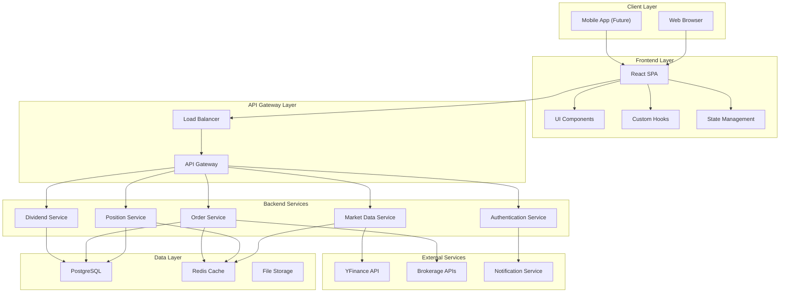
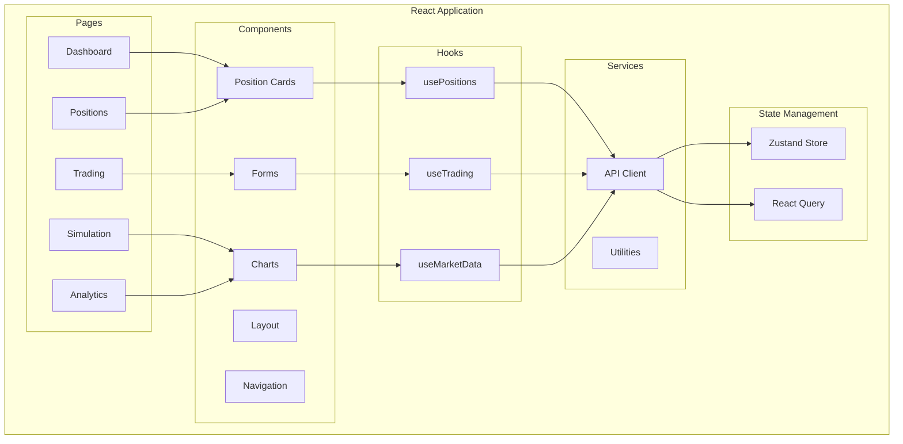
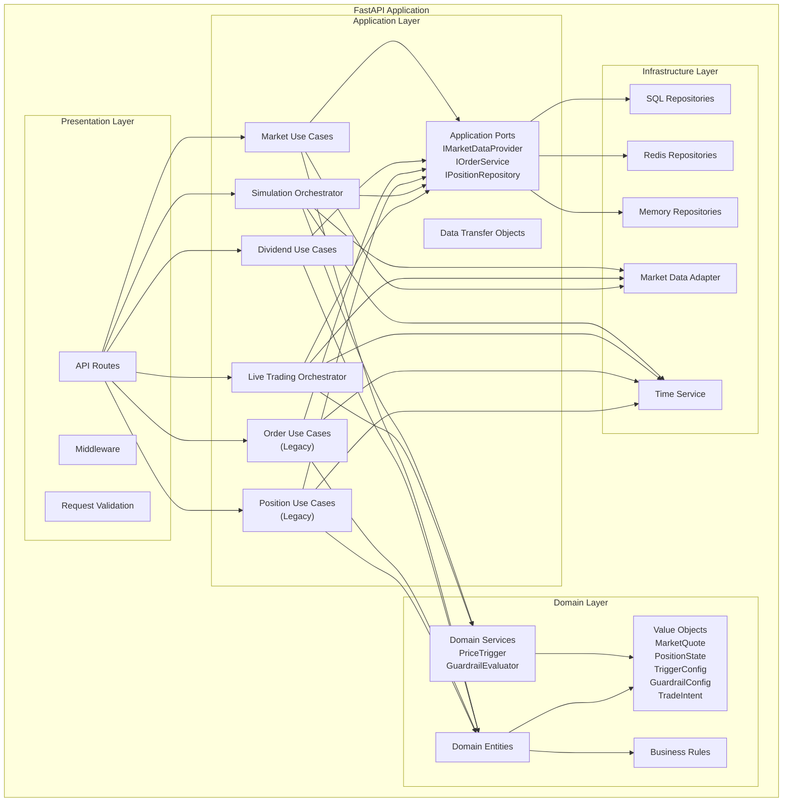
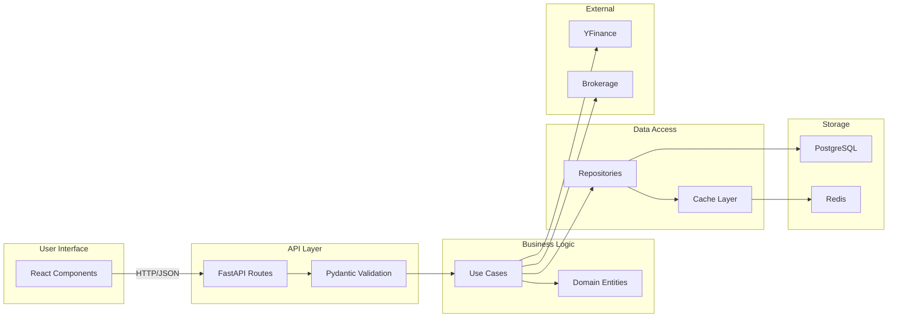
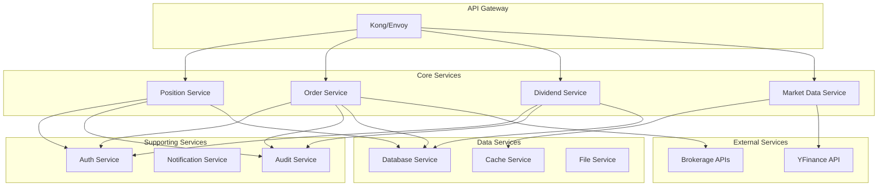
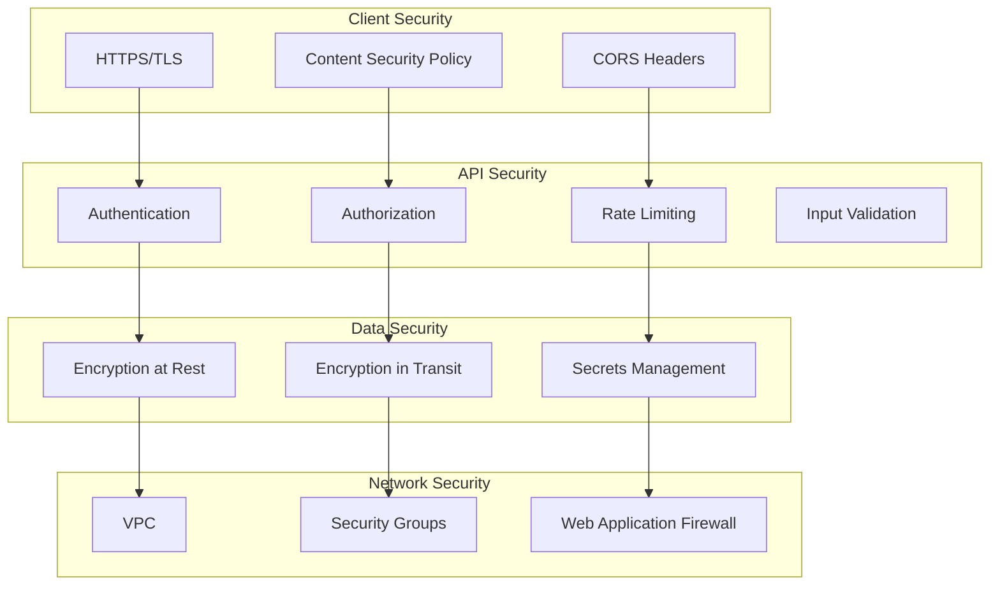
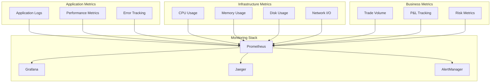
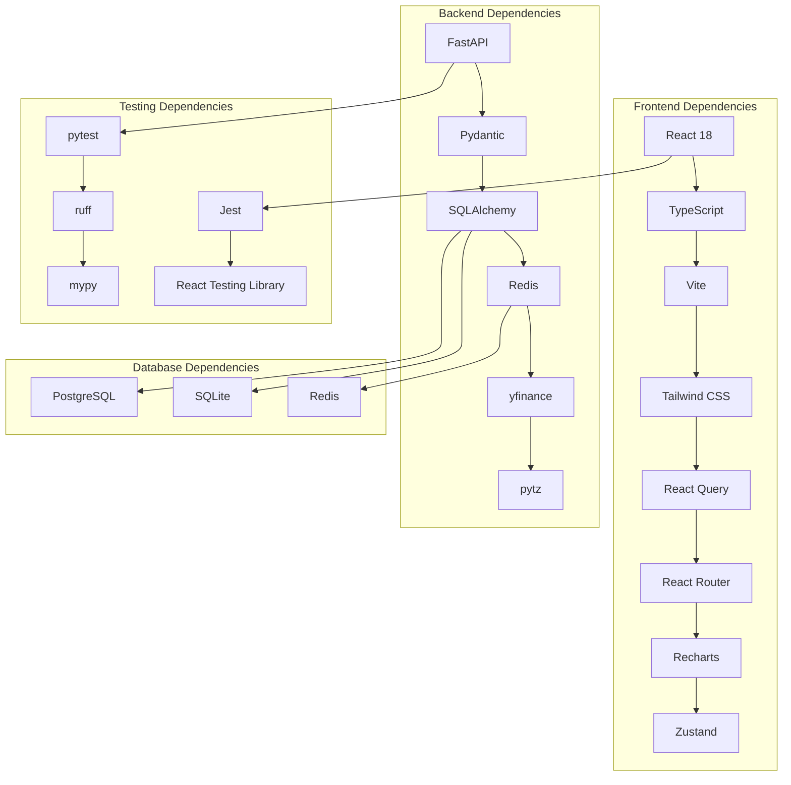

# Component Architecture

This document provides detailed component architecture diagrams for the Volatility Balancing system.

## System Overview

## Frontend Component Architecture

## Backend Service Architecture

## Data Flow Architecture

## Microservices Architecture (Future)

## Security Architecture

## Monitoring Architecture

## Component Dependencies

