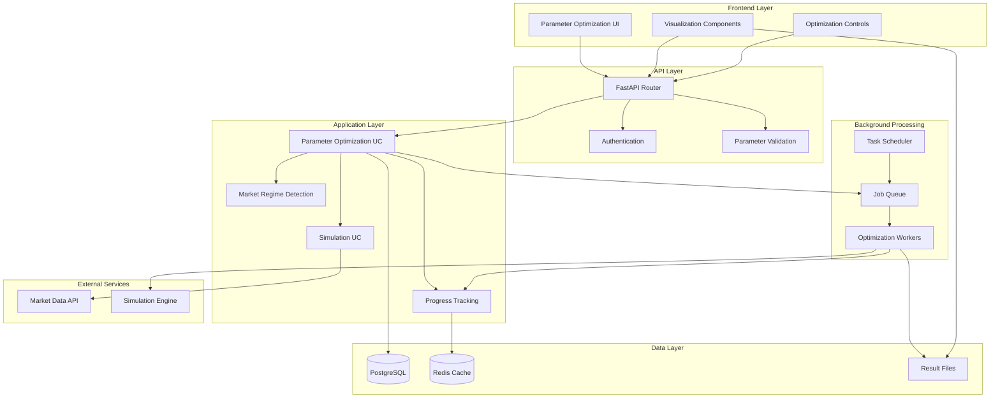

# Parameter Optimization System — Technical Design

## 1. Overview

The Parameter Optimization System extends the existing volatility balancing trading system to enable systematic parameter sweeping and performance analysis. The system leverages the current simulation infrastructure while adding parallel execution capabilities, result storage, and advanced visualization components.

**Key Design Decisions:**

- **Modular Architecture:** Extend existing simulation use cases rather than creating parallel systems
- **Async Processing:** Use background job queues for long-running parameter sweeps
- **Incremental Storage:** Store optimization results incrementally to handle large datasets
- **Interactive Visualization:** Client-side rendering for responsive parameter exploration

## 2. Architecture Diagram



## 3. Data Model

### Core Tables

```sql
-- Parameter optimization configurations
CREATE TABLE optimization_configs (
    id UUID PRIMARY KEY DEFAULT gen_random_uuid(),
    name VARCHAR(255) NOT NULL,
    description TEXT,
    ticker VARCHAR(10) NOT NULL,
    start_date TIMESTAMP WITH TIME ZONE NOT NULL,
    end_date TIMESTAMP WITH TIME ZONE NOT NULL,
    initial_cash DECIMAL(15,2) NOT NULL,
    parameter_ranges JSONB NOT NULL, -- Parameter ranges and step sizes
    optimization_criteria JSONB NOT NULL, -- Performance metrics and weights
    market_regime_filter JSONB, -- Optional regime filtering
    created_by UUID NOT NULL,
    created_at TIMESTAMP WITH TIME ZONE DEFAULT NOW(),
    status VARCHAR(50) DEFAULT 'pending' -- pending, running, completed, failed
);

-- Individual parameter combinations
CREATE TABLE parameter_combinations (
    id UUID PRIMARY KEY DEFAULT gen_random_uuid(),
    optimization_config_id UUID REFERENCES optimization_configs(id),
    combination_index INTEGER NOT NULL,
    parameters JSONB NOT NULL, -- Actual parameter values
    status VARCHAR(50) DEFAULT 'pending', -- pending, running, completed, failed
    started_at TIMESTAMP WITH TIME ZONE,
    completed_at TIMESTAMP WITH TIME ZONE,
    error_message TEXT,
    UNIQUE(optimization_config_id, combination_index)
);

-- Simulation results for each parameter combination
CREATE TABLE optimization_results (
    id UUID PRIMARY KEY DEFAULT gen_random_uuid(),
    parameter_combination_id UUID REFERENCES parameter_combinations(id),
    simulation_result_id UUID, -- Reference to simulation result
    performance_metrics JSONB NOT NULL, -- Calculated performance metrics
    market_regime VARCHAR(50), -- Detected market regime
    created_at TIMESTAMP WITH TIME ZONE DEFAULT NOW()
);

-- Optimization progress tracking
CREATE TABLE optimization_progress (
    optimization_config_id UUID PRIMARY KEY REFERENCES optimization_configs(id),
    total_combinations INTEGER NOT NULL,
    completed_combinations INTEGER DEFAULT 0,
    failed_combinations INTEGER DEFAULT 0,
    current_combination_index INTEGER,
    started_at TIMESTAMP WITH TIME ZONE DEFAULT NOW(),
    estimated_completion TIMESTAMP WITH TIME ZONE,
    last_updated TIMESTAMP WITH TIME ZONE DEFAULT NOW()
);

-- Market regime definitions
CREATE TABLE market_regimes (
    id UUID PRIMARY KEY DEFAULT gen_random_uuid(),
    name VARCHAR(100) NOT NULL,
    description TEXT,
    detection_criteria JSONB NOT NULL, -- Criteria for regime classification
    created_at TIMESTAMP WITH TIME ZONE DEFAULT NOW()
);
```

### Indexes

```sql
-- Performance indexes
CREATE INDEX idx_optimization_configs_status ON optimization_configs(status);
CREATE INDEX idx_parameter_combinations_config_status ON parameter_combinations(optimization_config_id, status);
CREATE INDEX idx_optimization_results_metrics ON optimization_results USING GIN(performance_metrics);
CREATE INDEX idx_optimization_results_regime ON optimization_results(market_regime);

-- Composite indexes for common queries
CREATE INDEX idx_optimization_results_config_regime ON optimization_results(parameter_combination_id, market_regime);
```

## 4. API Contracts

### Parameter Optimization Endpoints

```python
# POST /v1/optimization/configs
class OptimizationConfigRequest(BaseModel):
    name: str
    description: Optional[str] = None
    ticker: str
    start_date: datetime
    end_date: datetime
    initial_cash: float
    parameter_ranges: Dict[str, ParameterRange]
    optimization_criteria: OptimizationCriteria
    market_regime_filter: Optional[MarketRegimeFilter] = None

class ParameterRange(BaseModel):
    min_value: float
    max_value: float
    step_size: float
    parameter_type: str  # "continuous", "discrete"

class OptimizationCriteria(BaseModel):
    primary_metric: str  # "sharpe_ratio", "return", "max_drawdown"
    secondary_metrics: List[str] = []
    constraints: Dict[str, Constraint] = {}
    weights: Dict[str, float] = {}

class Constraint(BaseModel):
    min_value: Optional[float] = None
    max_value: Optional[float] = None
    required: bool = True

# GET /v1/optimization/configs/{config_id}/progress
class OptimizationProgressResponse(BaseModel):
    config_id: str
    status: str
    total_combinations: int
    completed_combinations: int
    failed_combinations: int
    progress_percentage: float
    estimated_completion: Optional[datetime]
    current_combination: Optional[Dict[str, Any]]

# GET /v1/optimization/configs/{config_id}/results
class OptimizationResultsResponse(BaseModel):
    config_id: str
    status: str
    total_combinations: int
    results: List[ParameterResult]
    summary_stats: OptimizationSummary
    market_regime_analysis: Optional[MarketRegimeAnalysis]

class ParameterResult(BaseModel):
    combination_id: str
    parameters: Dict[str, Any]
    performance_metrics: Dict[str, float]
    market_regime: str
    rank: int
    percentile: float

class OptimizationSummary(BaseModel):
    best_parameters: Dict[str, Any]
    best_metrics: Dict[str, float]
    parameter_statistics: Dict[str, ParameterStats]
    performance_distribution: Dict[str, float]

class ParameterStats(BaseModel):
    mean: float
    std: float
    min: float
    max: float
    optimal_range: Tuple[float, float]
```

### Visualization Data Endpoints

```python
# GET /v1/optimization/configs/{config_id}/heatmap
class HeatmapDataRequest(BaseModel):
    x_parameter: str
    y_parameter: str
    metric: str = "sharpe_ratio"
    market_regime: Optional[str] = None

class HeatmapDataResponse(BaseModel):
    x_values: List[float]
    y_values: List[float]
    z_values: List[List[float]]  # 2D array of metric values
    metadata: Dict[str, Any]

# GET /v1/optimization/configs/{config_id}/sensitivity
class SensitivityAnalysisResponse(BaseModel):
    parameter_sensitivity: Dict[str, float]  # Parameter -> sensitivity score
    interaction_effects: List[ParameterInteraction]
    stability_analysis: Dict[str, float]

class ParameterInteraction(BaseModel):
    parameter1: str
    parameter2: str
    interaction_strength: float
    interaction_type: str  # "synergistic", "antagonistic", "neutral"
```

## 5. Sequence / Lifecycle

### Parameter Optimization Workflow

```mermaid
sequenceDiagram
    participant UI as Frontend UI
    participant API as FastAPI Router
    participant OPT as Optimization UC
    participant QUEUE as Job Queue
    participant WORKER as Optimization Worker
    participant SIM as Simulation UC
    participant DB as Database
    participant CACHE as Redis Cache

    UI->>API: POST /optimization/configs
    API->>OPT: create_optimization_config()
    OPT->>DB: Store config & generate combinations
    OPT->>QUEUE: Enqueue optimization jobs
    API-->>UI: Return config_id

    UI->>API: GET /optimization/configs/{id}/progress
    API->>CACHE: Get progress from cache
    API-->>UI: Return progress status

    loop For each parameter combination
        QUEUE->>WORKER: Process combination
        WORKER->>SIM: run_simulation()
        SIM-->>WORKER: Return simulation result
        WORKER->>OPT: calculate_performance_metrics()
        WORKER->>DB: Store results
        WORKER->>CACHE: Update progress
    end

    UI->>API: GET /optimization/configs/{id}/results
    API->>DB: Query optimization results
    API->>OPT: generate_analysis()
    API-->>UI: Return results & visualizations
```

### Market Regime Detection

```mermaid
sequenceDiagram
    participant OPT as Optimization UC
    participant REG as Regime Detection
    participant DATA as Market Data
    participant ML as ML Service

    OPT->>REG: detect_market_regimes()
    REG->>DATA: Get historical price data
    DATA-->>REG: Return price series
    REG->>ML: Classify market regimes
    ML-->>REG: Return regime labels
    REG->>OPT: Return regime segments
    OPT->>OPT: Segment results by regime
```

## 6. Security & Compliance

### Authentication & Authorization

- **JWT-based authentication** for all optimization endpoints
- **Role-based access control** (RBAC) for optimization configurations
- **Resource-level permissions** for optimization data access

### Data Protection

- **Encryption at rest** for optimization results and parameter configurations
- **Audit logging** for all optimization activities and parameter changes
- **Data retention policies** (7 years for regulatory compliance)

### Input Validation

- **Parameter range validation** to prevent resource exhaustion
- **Rate limiting** on optimization requests (max 5 concurrent per user)
- **Input sanitization** for all user-provided parameter ranges

## 7. Observability

### Metrics

- **Optimization completion rate** (target: >95%)
- **Average optimization duration** by parameter space size
- **Resource utilization** (CPU, memory, database connections)
- **Error rates** by optimization phase

### Logging

- **Structured logging** for all optimization activities
- **Performance tracing** for individual parameter combinations
- **Error tracking** with detailed stack traces and context

### Monitoring

- **Real-time dashboards** for optimization queue status
- **Alerting** for failed optimizations and resource limits
- **Performance monitoring** for database queries and simulation execution

## 8. Rollout Plan

### Phase 1: Core Infrastructure (Weeks 1-2)

- Database schema implementation
- Basic optimization use case
- Simple parameter range validation
- Sequential processing (no parallelization)

### Phase 2: Parallel Processing (Weeks 3-4)

- Background job queue implementation
- Parallel simulation execution
- Progress tracking and monitoring
- Basic error handling and retry logic

### Phase 3: Visualization (Weeks 5-6)

- Heatmap visualization components
- Performance metrics dashboard
- Parameter sensitivity analysis
- Export/import functionality

### Phase 4: Advanced Features (Weeks 7-8)

- Market regime detection
- Multi-objective optimization
- Parameter stability analysis
- Advanced visualization tools

## 9. Alternatives Considered

### Alternative 1: External Optimization Libraries

**Pros:** Mature optimization algorithms, extensive functionality
**Cons:** Additional dependencies, integration complexity, licensing costs
**Decision:** Custom implementation for better control and integration

### Alternative 2: Real-time Parameter Optimization

**Pros:** Immediate parameter updates, adaptive algorithms
**Cons:** High computational overhead, potential instability
**Decision:** Batch optimization for stability and performance

### Alternative 3: Cloud-based Optimization Service

**Pros:** Scalable compute resources, managed infrastructure
**Cons:** Data privacy concerns, vendor lock-in, additional costs
**Decision:** On-premises solution for data control and cost efficiency

## 10. Performance Considerations

### Computational Requirements

- **Parameter Space Size:** Support up to 10,000 combinations per optimization
- **Concurrent Simulations:** Maximum 10 parallel simulations
- **Memory Usage:** <2GB per optimization worker
- **Database Performance:** Optimized queries for large result sets

### Scalability

- **Horizontal Scaling:** Multiple optimization workers
- **Database Partitioning:** Partition results by optimization config
- **Caching Strategy:** Redis for progress tracking and frequent queries
- **File Storage:** Efficient storage for large result datasets

### Optimization Strategies

- **Grid Search:** Systematic parameter space exploration
- **Random Search:** Efficient sampling for large parameter spaces
- **Bayesian Optimization:** Smart parameter selection (future enhancement)
- **Multi-objective Optimization:** Pareto frontier analysis (future enhancement)
