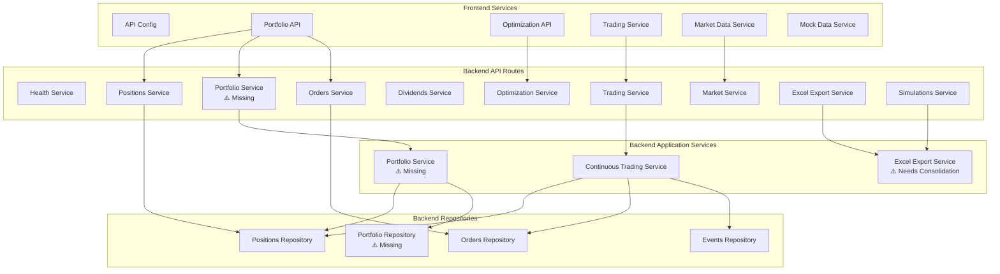
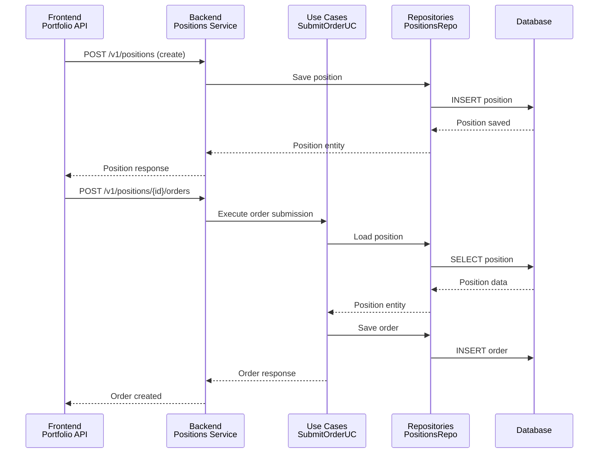

# Services Architecture - Volatility Balancing

**Version**: 1.0  
**Date**: January 2025  
**Status**: Architecture Documentation  
**Purpose**: Document all frontend and backend services for architectural review and discussion

---

## Executive Summary

This document catalogs all services in the Volatility Balancing system, organized by frontend and backend layers. It identifies service boundaries, responsibilities, and highlights key architectural gaps that require discussion.

**Key Finding**: The system has a **portfolio abstraction mismatch** - the frontend treats multiple positions as a portfolio, while the backend only manages individual positions with no grouping mechanism.

---

## Table of Contents

1. [Frontend Services](#frontend-services)
2. [Backend API Route Services](#backend-api-route-services)
3. [Backend Application Services](#backend-application-services)
4. [Service Relationships](#service-relationships)
5. [Architectural Discussion Points](#architectural-discussion-points)

---

## Frontend Services

Frontend services are located in `frontend/src/services/` and provide API clients and data management for the React application.

### 1. API Configuration Service (`api.ts`)

**Purpose**: Centralized API configuration  
**Description**: Provides base URL configuration for all API calls. Uses environment variables (`VITE_API_BASE_URL`) with fallback to `/api`.

**Key Features**:

- Environment-based configuration
- Single source of truth for API endpoints

---

### 2. Portfolio API Service (`portfolioApi.ts`)

**Purpose**: Position management and portfolio operations  
**Description**: Handles all CRUD operations for positions. Provides the primary interface for managing trading positions.

**Key Methods**:

- `getPositions()` - Retrieve all positions
- `createPosition()` - Create new position
- `updatePosition()` - Update existing position
- `deletePosition()` - Delete position
- `getPosition()` - Get single position by ID
- `clearAllPositions()` - Clear all positions (dev/test)

**Note**: Despite the name "Portfolio API", this service only manages individual positions. The frontend aggregates positions into a portfolio concept via `PortfolioContext`.

---

### 3. Optimization API Service (`optimizationApi.ts`)

**Purpose**: Parameter optimization management  
**Description**: Complete interface for parameter optimization workflows including configuration, execution, progress tracking, and results analysis.

**Key Methods**:

- **Configuration**: `createConfig()`, `getConfig()`, `getAllConfigs()`
- **Execution**: `startOptimization()`, `getProgress()`, `pollProgress()`
- **Results**: `getResults()`, `getHeatmap()`
- **Metadata**: `getMetrics()`, `getParameterTypes()`

**Features**:

- Built-in polling mechanism for progress updates
- Heatmap data generation for parameter visualization
- Multiple optimization metrics support

---

### 4. Trading Service (`tradingService.ts`)

**Purpose**: Continuous trading operations  
**Description**: Manages automated trading lifecycle for positions including start, stop, pause, resume, and status monitoring.

**Key Methods**:

- `startTrading()` - Start continuous trading for a position
- `stopTrading()` - Stop continuous trading
- `pauseTrading()` - Pause trading temporarily
- `resumeTrading()` - Resume paused trading
- `getTradingStatus()` - Get current trading status
- `listActiveTrading()` - List all actively trading positions

**Features**:

- Configurable polling intervals
- Status tracking (checks, trades, errors)
- Multi-position trading support

---

### 5. Market Data Service (`marketDataService.ts`)

**Purpose**: Real-time and historical market data  
**Description**: Fetches stock quotes, historical data, and company information from Alpha Vantage API.

**Key Methods**:

- `getStockQuote()` - Current stock price and quote data
- `getHistoricalData()` - Historical price data for date ranges
- `getCompanyInfo()` - Company details, sector, industry info

**Features**:

- Alpha Vantage API integration
- Error handling with user-friendly messages
- Demo API key support for development

---

### 6. Mock Data Service (`mockDataService.ts`)

**Purpose**: Development and testing data  
**Description**: Provides mock market data for development, testing, and demos when real API is unavailable.

**Key Methods**:

- `getMockQuote()` - Mock stock quotes
- `getMockHistoricalData()` - Mock historical data
- `getMockCompanyInfo()` - Mock company information

**Use Case**: Used when Alpha Vantage API is unavailable or for offline development.

---

## Backend API Route Services

Backend API routes are located in `backend/app/routes/` and expose REST endpoints for frontend consumption.

### 1. Health Service (`health.py`)

**Purpose**: System health monitoring  
**Description**: Simple health check endpoint for monitoring and load balancer health checks.

**Endpoints**:

- `GET /v1/healthz` - Returns system status

**Use Case**: Infrastructure monitoring, deployment verification

---

### 2. Positions Service (`positions.py`)

**Purpose**: Position lifecycle management  
**Description**: Comprehensive position management including CRUD operations, evaluation, anchor price management, and simulation presets.

**Key Endpoints**:

- `GET /v1/positions` - List all positions
- `POST /v1/positions` - Create new position
- `GET /v1/positions/{id}` - Get position details
- `POST /v1/positions/{id}/anchor` - Set anchor price
- `POST /v1/positions/{id}/evaluate` - Evaluate position with current price
- `POST /v1/positions/{id}/orders` - Submit order for position
- `DELETE /v1/positions/{id}` - Delete position
- `POST /v1/clear-positions` - Clear all positions (dev/test)

**Additional Features**:

- Position evaluation with trigger detection
- Auto-sizing order calculations
- Simulation preset management
- Portfolio state management (see note below)

**Note**: This service includes `/portfolio-state/*` endpoints, but `PortfolioState` is misleadingly named - it's actually a single-position state snapshot (tied to one ticker), not a multi-position portfolio.

---

### 3. Orders Service (`orders.py`)

**Purpose**: Order submission and execution  
**Description**: Handles order lifecycle from submission through execution, with idempotency support and guardrail validation.

**Key Endpoints**:

- `POST /v1/positions/{position_id}/orders` - Submit new order
- `POST /v1/orders/{order_id}/fill` - Fill/execute an order
- `GET /v1/orders/{order_id}` - Get order status

**Features**:

- Idempotency key support (via header)
- Guardrail validation
- Order state management
- Trade execution tracking

---

### 4. Dividends Service (`dividends.py`)

**Purpose**: Dividend management  
**Description**: Handles dividend announcements, payments, and receivable tracking.

**Key Endpoints**:

- `POST /v1/dividends/announce` - Announce new dividend
- `POST /v1/dividends/pay` - Process dividend payment
- `GET /v1/dividends/receivables` - List dividend receivables
- `GET /v1/dividends/receivables/{id}` - Get receivable details

**Features**:

- Dividend announcement tracking
- Receivable management
- Payment processing
- Withholding tax handling

---

### 5. Market Service (`market.py`)

**Purpose**: Market data and status  
**Description**: Provides market status, price quotes, and historical data.

**Key Endpoints**:

- `GET /v1/market/status` - Get market open/close status
- `GET /v1/market/quote/{ticker}` - Get current price quote
- `GET /v1/market/historical/{ticker}` - Get historical price data

**Features**:

- Market hours detection
- Real-time price quotes
- Historical data retrieval
- YFinance integration

---

### 6. Optimization Service (`optimization.py`)

**Purpose**: Parameter optimization  
**Description**: Complete optimization workflow management including configuration, execution, progress tracking, results, and heatmaps.

**Key Endpoints**:

- `POST /v1/optimization/configs` - Create optimization config
- `GET /v1/optimization/configs` - List all configs
- `GET /v1/optimization/configs/{id}` - Get config details
- `POST /v1/optimization/configs/{id}/start` - Start optimization
- `GET /v1/optimization/configs/{id}/progress` - Get optimization progress
- `GET /v1/optimization/configs/{id}/results` - Get optimization results
- `GET /v1/optimization/configs/{id}/heatmap` - Get heatmap data
- `GET /v1/optimization/metrics` - Get available metrics
- `GET /v1/optimization/parameter-types` - Get parameter type info

**Features**:

- Multi-parameter optimization
- Heatmap visualization data
- Progress tracking
- Multiple optimization metrics

---

### 7. Trading Service (`trading.py`)

**Purpose**: Continuous trading control  
**Description**: Manages automated trading lifecycle for positions.

**Key Endpoints**:

- `POST /v1/trading/start/{position_id}` - Start continuous trading
- `POST /v1/trading/stop/{position_id}` - Stop continuous trading
- `POST /v1/trading/pause/{position_id}` - Pause trading
- `POST /v1/trading/resume/{position_id}` - Resume trading
- `GET /v1/trading/status/{position_id}` - Get trading status
- `GET /v1/trading/active` - List all active trading positions

**Features**:

- Configurable polling intervals
- Status tracking and monitoring
- Multi-position support
- Error tracking

---

### 8. Excel Export Service (`excel_export.py`)

**Purpose**: Data export to Excel  
**Description**: Exports portfolio data, optimization results, and simulation data to Excel format.

**Key Endpoints**:

- `GET /v1/excel/portfolio/{position_id}` - Export position to Excel
- `GET /v1/excel/optimization/{config_id}` - Export optimization results
- `GET /v1/excel/simulation/{simulation_id}` - Export simulation results

**Features**:

- Multiple export formats (basic, enhanced, comprehensive)
- Template-based exports
- Multiple worksheet support
- Formatted Excel files

---

### 9. Simulations Service (`simulations.py`)

**Purpose**: Simulation management  
**Description**: Handles backtesting simulations and historical analysis.

**Key Endpoints**:

- `GET /v1/simulations` - List all simulations
- `POST /v1/simulations` - Create/run new simulation
- `GET /v1/simulations/{id}` - Get simulation details
- `GET /v1/simulations/{id}/export` - Export simulation to Excel

**Features**:

- Historical backtesting
- Parameter variation testing
- Performance analysis
- Export capabilities

---

## Backend Application Services

Application services are located in `backend/application/services/` and contain business logic that supports the API routes.

### 1. Continuous Trading Service (`continuous_trading_service.py`)

**Purpose**: 24/7 automated trading execution  
**Description**: Background service that monitors positions at regular intervals, evaluates triggers, and automatically submits/fills orders.

**Key Features**:

- Position monitoring with configurable intervals
- Automatic trigger evaluation
- Order submission and execution
- Error handling and recovery
- Status tracking per position
- Thread-based execution

**Responsibilities**:

- Poll positions at configured intervals
- Evaluate positions for trading triggers
- Submit orders when triggers are met
- Fill orders automatically (virtual trading)
- Track trading statistics

---

### 2. Excel Export Service (`excel_export_service.py`) ⚠️ **NEEDS CONSOLIDATION**

**Purpose**: Excel export functionality  
**Description**: Service for exporting data to Excel format with professional formatting.

**Current State**: **Over-fragmented** - There are 4 separate services with overlapping responsibilities:

- `ExcelExportService` - Thin wrapper that delegates to `ExcelTemplateService`
- `EnhancedExcelExportService` - Has some unique methods but many placeholders
- `ComprehensiveExcelExportService` - Position-specific comprehensive exports
- `ExcelTemplateService` - Main implementation with all the actual work

**Key Features** (Current):

- Optimization results export
- Simulation results export
- Trading data export (positions, trades, orders)
- Activity log export
- Professional formatting and templates

**Consolidation Recommendation**:

- **Merge into single `ExcelExportService`** with clear method organization:
  - `export_optimization_results()` - Optimization reports
  - `export_simulation_results()` - Simulation reports
  - `export_trading_data()` - Trading audit reports
  - `export_position_comprehensive()` - Comprehensive per-position exports
  - `export_activity_log()` - Event/activity logs
- **Internal organization**:
  - Template/formatter classes for different export types (strategy pattern)
  - Shared utilities for formatting, column auto-fit, styling
  - Clear separation: data preparation vs. Excel generation
- **Remove redundant services**: `EnhancedExcelExportService`, `ComprehensiveExcelExportService` (merge functionality)
- **Keep template logic**: But organize as internal helper classes, not separate service

**Benefits of Consolidation**:

- Single service to maintain
- Clear API surface
- Easier to test
- Less confusion about which service to use
- Better code reuse

---

### 3. Portfolio Service (`portfolio_service.py`) ⚠️ **MISSING**

**Purpose**: Portfolio-level aggregation and management  
**Description**: Service for managing portfolios as collections of positions, providing portfolio-level analytics, aggregation, and operations.

**Status**: **Not yet implemented** - Currently, portfolios are frontend-only aggregations. This service should be created to support backend portfolio operations.

**Proposed Key Features**:

- Portfolio creation and management
- Position aggregation within portfolios
- Portfolio-level analytics (total value, aggregate P&L, allocation percentages)
- Portfolio-level guardrails (cross-position limits)
- Portfolio performance tracking
- Multi-position rebalancing coordination

**Proposed Responsibilities**:

- Aggregate positions into portfolio views
- Calculate portfolio-level metrics (total value, allocation percentages)
- Enforce portfolio-level guardrails (max total exposure, diversification rules)
- Coordinate multi-position operations (rebalancing, risk management)
- Provide portfolio performance analytics

**Note**: This service would complement the existing Position service. Positions remain the core trading entity, while portfolios provide grouping and aggregation capabilities.

---

## Portfolio Service Dependency Chain Analysis

### Current Dependency Flow (Missing Portfolio Layer)

```
Frontend Layer:
  PortfolioContext (aggregates positions client-side)
    ↓
  PortfolioApiService (calls /positions endpoints)
    ↓
Backend API Layer:
  /v1/positions/* (Positions API Route)
    ↓
Backend Application Layer:
  [No Portfolio Service] ⚠️ MISSING
    ↓
Backend Domain/Repository Layer:
  Positions Repository (individual positions only)
```

### What's Missing at Each Layer

#### 1. Backend API Route Layer ⚠️ **MISSING**

**Location**: `backend/app/routes/portfolios.py`  
**Status**: Does not exist

**Missing Endpoints**:

- `GET /v1/portfolios` - List all portfolios
- `POST /v1/portfolios` - Create new portfolio
- `GET /v1/portfolios/{portfolio_id}` - Get portfolio details
- `PUT /v1/portfolios/{portfolio_id}` - Update portfolio
- `DELETE /v1/portfolios/{portfolio_id}` - Delete portfolio
- `GET /v1/portfolios/{portfolio_id}/positions` - Get positions in portfolio
- `POST /v1/portfolios/{portfolio_id}/positions/{position_id}` - Add position to portfolio
- `DELETE /v1/portfolios/{portfolio_id}/positions/{position_id}` - Remove position from portfolio
- `GET /v1/portfolios/{portfolio_id}/analytics` - Portfolio-level analytics
- `GET /v1/portfolios/{portfolio_id}/summary` - Portfolio summary (total value, P&L, etc.)

**Current State**: Only `/v1/positions/*` endpoints exist. No portfolio grouping at API level.

---

#### 2. Backend Application Service Layer ⚠️ **MISSING**

**Location**: `backend/application/services/portfolio_service.py`  
**Status**: Does not exist

**Missing Service Methods**:

- `create_portfolio()` - Create new portfolio
- `get_portfolio()` - Get portfolio by ID
- `list_portfolios()` - List all portfolios
- `update_portfolio()` - Update portfolio metadata
- `delete_portfolio()` - Delete portfolio
- `add_position_to_portfolio()` - Add position to portfolio
- `remove_position_from_portfolio()` - Remove position from portfolio
- `get_portfolio_positions()` - Get all positions in portfolio
- `calculate_portfolio_metrics()` - Aggregate portfolio-level metrics
- `get_portfolio_summary()` - Total value, aggregate P&L, allocation percentages
- `enforce_portfolio_guardrails()` - Portfolio-level guardrail validation

**Current State**: No portfolio service exists. All portfolio logic is frontend-only.

---

#### 3. Backend Domain Entity Layer ⚠️ **MISSING**

**Location**: `backend/domain/entities/portfolio.py`  
**Status**: Does not exist

**Missing Entity**:

```python
@dataclass
class Portfolio:
    id: str
    name: str
    description: Optional[str]
    user_id: str  # For multi-user support
    created_at: datetime
    updated_at: datetime
    # Relationships: positions (via portfolio_positions junction)
```

**Current State**: Only `Position` entity exists. No `Portfolio` entity.

---

#### 4. Backend Repository Layer ⚠️ **MISSING**

**Location**: `backend/infrastructure/persistence/sql/portfolio_repo_sql.py`  
**Status**: Does not exist

**Missing Repository Methods**:

- `create()` - Create portfolio
- `get()` - Get portfolio by ID
- `list_all()` - List all portfolios
- `update()` - Update portfolio
- `delete()` - Delete portfolio
- `get_positions()` - Get positions in portfolio
- `add_position()` - Add position to portfolio
- `remove_position()` - Remove position from portfolio

**Missing Database Tables**:

- `portfolios` table (portfolio metadata)
- `portfolio_positions` junction table (many-to-many relationship)

**Current State**: Only `positions` table exists. No portfolio persistence.

---

### Proposed Dependency Flow (With Portfolio Layer)

```
Frontend Layer:
  PortfolioContext (uses portfolio API)
    ↓
  PortfolioApiService (calls /portfolios endpoints)
    ↓
Backend API Layer:
  /v1/portfolios/* (Portfolio API Route) ✅ TO BE ADDED
    ↓
Backend Application Layer:
  PortfolioService ✅ TO BE ADDED
    ↓
Backend Domain/Repository Layer:
  Portfolio Entity ✅ TO BE ADDED
  Portfolio Repository ✅ TO BE ADDED
  Portfolio-Position Junction ✅ TO BE ADDED
```

### Integration Points

**Portfolio Service Dependencies** (Correct Layer Dependencies):

- **Positions Repository** (Repository Layer): To fetch position details for portfolio aggregation
- **Portfolio Repository** (Repository Layer): To manage portfolio CRUD and position associations
- **Market Data Service** (Application Service Layer): To get current prices for portfolio valuation
- **Events Repository** (Repository Layer): To track portfolio-level events

**Portfolio Service Consumers** (Higher Layers):

- **Portfolio API Route** (API Route Layer): Exposes portfolio endpoints to frontend
- **Excel Export Service** (Application Service Layer): Can export portfolio-level reports
- **Analytics Service** (Application Service Layer, future): Portfolio-level analytics

**Dependency Rule**: Application Services depend on Repositories (lower layer), not API Routes (higher layer). This maintains proper separation of concerns and avoids circular dependencies. The diagram above shows `APP_PORT --> REPO_POS` and `APP_PORT --> REPO_PORT`, which is correct.

---

## Service Relationships

### Frontend to Backend Mapping



### Data Flow Example: Position Management



---

## Portfolio vs Position: Role Alignment

### Core Concepts

**Position**:

- **Definition**: A single trading position for one ticker/symbol
- **Scope**: Individual ticker with its own cash, quantity, guardrails, and order policies
- **Trading Logic**: Each position operates independently with its own volatility balancing strategy
- **Entity**: `Position` domain entity in `backend/domain/entities/position.py`
- **Service**: Managed by Positions Service (`positions.py`) API routes
- **Persistence**: Stored in `positions` table with position-specific configuration

**Portfolio**:

- **Definition**: A collection of multiple positions grouped together
- **Scope**: Multi-position aggregation for portfolio-level analytics and management
- **Trading Logic**: Portfolios coordinate positions but positions still trade independently
- **Entity**: **Not yet implemented** - Currently frontend-only aggregation
- **Service**: **Portfolio Service is missing** - Should be created in `backend/application/services/portfolio_service.py`
- **Persistence**: **Not yet implemented** - Would require `portfolios` table and `portfolio_positions` junction table

**PortfolioState** (Misleadingly Named):

- **Definition**: A state snapshot for a **single position** (not a portfolio)
- **Scope**: Tracks initial and current state (cash, asset value, units) for one ticker
- **Purpose**: Historical snapshots of position state for analysis and simulation
- **Entity**: `PortfolioState` in `backend/infrastructure/persistence/sql/portfolio_state_repo_sql.py`
- **Issue**: Name suggests multi-position portfolio, but it's actually a single-position state snapshot
- **Recommendation**: Consider renaming to `PositionState` for clarity

### Role Separation

| Aspect              | Position                  | Portfolio                               | PortfolioState             |
| ------------------- | ------------------------- | --------------------------------------- | -------------------------- |
| **Scope**           | Single ticker             | Multiple positions                      | Single position snapshot   |
| **Trading**         | Independent trading logic | Coordinates positions                   | No trading (snapshot only) |
| **Guardrails**      | Position-level limits     | Portfolio-level limits (if implemented) | N/A                        |
| **Analytics**       | Position P&L, allocation  | Aggregate portfolio metrics             | Historical state tracking  |
| **Backend Entity**  | ✅ Exists                 | ❌ Missing                              | ✅ Exists (misnamed)       |
| **Backend Service** | ✅ Positions Service      | ❌ Missing                              | ❌ No service (repo only)  |

### Current Architecture

```
Frontend (PortfolioContext)
    ↓ aggregates
Multiple Positions (Backend)
    ↓ each position has
PortfolioState snapshots (Backend, misnamed)
```

### Proposed Architecture

```
Frontend (PortfolioContext)
    ↓
Portfolio Service (Backend) ← MISSING
    ↓ manages
Portfolio Entity (Backend) ← MISSING
    ↓ contains
Multiple Positions (Backend)
    ↓ each position has
PositionState snapshots (Backend, renamed from PortfolioState)
```

---

## Architectural Discussion Points

### 1. Portfolio Abstraction Gap ⚠️ **CRITICAL**

**Current State**:

- **Frontend**: Has `PortfolioContext` that aggregates multiple positions into a "portfolio" concept
- **Frontend API Service**: `PortfolioApiService` only calls `/v1/positions/*` endpoints (no portfolio endpoints)
- **Backend API Routes**: Only `/v1/positions/*` exists. No `/v1/portfolios/*` endpoints
- **Backend Application Services**: No `PortfolioService` exists
- **Backend Domain**: Only `Position` entity exists. No `Portfolio` entity
- **Backend Repositories**: Only `PositionsRepository` exists. No `PortfolioRepository`
- **Backend Database**: Only `positions` table exists. No `portfolios` or `portfolio_positions` tables
- **PortfolioState**: Misleadingly named - it's actually a single-position state snapshot (tied to one ticker), not a multi-position portfolio

**The Problem**:

- **Dependency Chain Gap**: Frontend → Backend API → Backend Service → Backend Domain → Backend Repository
  - All layers missing portfolio support except frontend (which does client-side aggregation)
- Frontend assumes portfolio-level operations (aggregate views, portfolio-wide analytics)
- Backend treats each position as completely independent
- No way to group positions into portfolios at the backend level
- PortfolioState is confusing - it's not a portfolio, it's a position state snapshot
- No backend service to handle portfolio-level operations
- All portfolio aggregation happens client-side, making it impossible to:
  - Share portfolios between users
  - Persist portfolio configurations
  - Enforce portfolio-level guardrails
  - Provide portfolio-level analytics from backend

**Questions for Discussion**:

1. Should the backend have a true `Portfolio` entity that groups multiple positions?
2. Should portfolio-level operations (aggregate value, portfolio analytics) be backend services?
3. Should `PortfolioState` be renamed to `PositionState` to reflect its actual purpose?
4. How should portfolio-level guardrails work (if positions are grouped)?
5. Should the Portfolio Service coordinate multi-position rebalancing?

**Recommendations**:

- **Option A**: Add `Portfolio` entity to backend with portfolio_id foreign key on positions, implement Portfolio Service
- **Option B**: Keep current architecture but rename `PortfolioState` to `PositionState` and document that portfolios are frontend-only
- **Option C**: Hybrid - add portfolio grouping but keep positions independent for trading logic, Portfolio Service provides aggregation only

---

### 2. Excel Export Service Consolidation ⚠️ **HIGH PRIORITY**

**Current Problem**:

- **4 separate services** with overlapping responsibilities and redundancy:
  1. `ExcelExportService` - Just a thin wrapper delegating to `ExcelTemplateService`
  2. `EnhancedExcelExportService` - Some unique methods but many placeholders
  3. `ComprehensiveExcelExportService` - Position-specific comprehensive exports
  4. `ExcelTemplateService` - Main implementation doing all the actual work
- **Issues**:
  - Confusion about which service to use
  - Code duplication (e.g., `_safe_auto_fit_columns` in multiple places)
  - Maintenance burden (4 files to update for changes)
  - Unclear boundaries between services

**Recommendation**:

- **Consolidate into single `ExcelExportService`** with:
  - Clear public API methods for each export type
  - Internal template/formatter classes (strategy pattern) for organization
  - Shared utilities module for common operations (formatting, column sizing, styling)
  - Single source of truth for Excel generation logic

**Migration Plan**:

1. Create unified `ExcelExportService` with all methods
2. Move unique functionality from `EnhancedExcelExportService` and `ComprehensiveExcelExportService`
3. Organize template logic as internal helper classes
4. Update all API routes to use single service
5. Remove redundant service files
6. Update tests to use consolidated service

**Market Data Services**:

- Frontend has `marketDataService.ts` (Alpha Vantage)
- Backend has `market.py` (YFinance)
- **Question**: Should market data be unified through backend only, or is frontend direct access intentional?

---

### 3. Service Boundaries

**Positions Service Scope**:

- Currently handles: CRUD, evaluation, anchor prices, portfolio state, simulation presets
- **Question**: Is this too broad? Should evaluation be a separate service?

**Trading Service Split**:

- API route: `trading.py` (control endpoints)
- Application service: `continuous_trading_service.py` (execution)
- **Status**: This separation is good - control vs execution

---

### 4. Missing Services

**Confirmed Gaps**:

1. **Portfolio Service**: ⚠️ **MISSING** - Should provide portfolio-level aggregation, analytics, and management
   - Location: Should be in `backend/application/services/portfolio_service.py`
   - Purpose: Aggregate positions, calculate portfolio metrics, enforce portfolio-level guardrails
   - Status: Documented in this architecture but not yet implemented

**Potential Gaps**:

1. **Analytics Service**: Portfolio-level analytics and reporting
2. **Notification Service**: Alerts and notifications for trading events
3. **Audit Service**: Comprehensive audit trail and compliance reporting

---

### 5. Naming Consistency

**Issues**:

- `PortfolioState` should be `PositionState` (it's not a portfolio, it's a single-position snapshot)
- `PortfolioApiService` in frontend manages positions, not portfolios (though it aggregates them)
- Consider renaming for clarity to avoid confusion between:
  - **Portfolio**: Multi-position collection (frontend concept, backend missing)
  - **Position**: Single ticker trading entity (backend exists)
  - **PortfolioState**: Single-position state snapshot (backend exists, misnamed)

---

## Recommendations Summary

### High Priority

1. **Implement Complete Portfolio Layer**: Add portfolio support at all backend layers:
   - **API Route**: Create `backend/app/routes/portfolios.py` with `/v1/portfolios/*` endpoints
   - **Application Service**: Create `backend/application/services/portfolio_service.py`
   - **Domain Entity**: Create `backend/domain/entities/portfolio.py`
   - **Repository**: Create `backend/infrastructure/persistence/sql/portfolio_repo_sql.py`
   - **Database**: Add `portfolios` and `portfolio_positions` tables
2. **Address Portfolio Abstraction Gap**: Decide on portfolio entity strategy (Option A, B, or C)
3. **Rename PortfolioState**: To `PositionState` to avoid confusion (it's a position snapshot, not a portfolio)
4. **Document Portfolio vs Position Roles**: Clearly document the separation of concerns (see "Portfolio vs Position: Role Alignment" section above)
5. **Update Frontend**: Update `PortfolioApiService` to call `/v1/portfolios/*` endpoints instead of only `/v1/positions/*`

### Medium Priority

1. **Consolidate Excel Services**: ⚠️ **HIGH PRIORITY** - Merge 4 services into 1 (see "Excel Export Service Consolidation" section)
2. **Unify Market Data**: Consider backend-only market data access
3. **Service Boundaries**: Review if Positions service is too broad

### Low Priority

1. **Naming Consistency**: Rename services for clarity
2. **Missing Services**: Evaluate need for Analytics, Notification, Audit services

---

## New Clean Architecture (Trading vs Simulation Spec)

**Status**: ✅ Foundation Complete (January 2025)

### Overview

A new clean architecture has been implemented following the Trading vs Simulation Spec, providing clear separation between domain logic, application orchestration, and infrastructure adapters.

### Architecture Layers

#### 1. Domain Layer (`backend/domain/`)

**Pure business logic. No HTTP, no DB, no external APIs.**

**Value Objects** (`domain/value_objects/`):

- `MarketQuote` - Market quote with ticker, price, timestamp, currency
- `PositionState` - Position state (ticker, qty, cash, dividend_receivable, anchor_price)
- `TriggerConfig` - Trigger thresholds (up_threshold_pct, down_threshold_pct)
- `GuardrailConfig` - Guardrail limits (min_stock_pct, max_stock_pct, max_trade_pct_of_position, max_daily_notional)
- `TriggerDecision` - Result of trigger evaluation (fired, direction, reason)
- `GuardrailDecision` - Result of guardrail evaluation (allowed, reason, trade_intent)
- `TradeIntent` - Desired trade (side, qty, reason)

**Domain Services** (`domain/services/`):

- `PriceTrigger.evaluate()` - Pure function to evaluate price triggers
- `GuardrailEvaluator.evaluate()` - Pure function to evaluate guardrails and generate trade intents

**Key Principles**:

- No dependencies on infrastructure
- Deterministic for given inputs
- Easy to unit test
- Shared between live trading and simulation

#### 2. Application Layer (`backend/application/`)

**Use cases, workflows, orchestration. Knows about domain and ports, but not concrete DB or HTTP.**

**Ports (Interfaces)** (`application/ports/`):

- `IMarketDataProvider` - Live market data
- `IHistoricalPriceProvider` - Historical market data
- `IOrderService` - Live order submission
- `ISimulationOrderService` - Simulated order submission
- `IPositionRepository` - Position repository operations
- `ISimulationPositionRepository` - Simulation position repository
- `IEventLogger` - Event logging

**Orchestrators** (`application/orchestrators/`):

- `LiveTradingOrchestrator` - Orchestrates live trading cycles
- `SimulationOrchestrator` - Orchestrates simulation runs

**Key Principles**:

- Orchestrators use domain services (PriceTrigger, GuardrailEvaluator)
- Orchestrators depend on ports (interfaces), not concrete implementations
- Live trading and simulation use the same domain logic
- Differences are handled by different orchestrators and adapters

#### 3. Infrastructure Layer (`backend/infrastructure/`)

**Actual IO: DB, Redis, external APIs, brokers, logging.**

**Status**: Adapters need to be created/updated to implement the new ports.

**Planned Adapters**:

- YFinance adapter for `IMarketDataProvider`
- Historical data adapter for `IHistoricalPriceProvider`
- Order service adapter for `IOrderService`
- Simulation order service adapter for `ISimulationOrderService`
- Position repository adapter for `IPositionRepository`
- Simulation position repository adapter for `ISimulationPositionRepository`
- Event logger adapter for `IEventLogger`

### Benefits

1. **Clean Separation**: Domain logic is independent of infrastructure
2. **Testability**: Domain services are pure functions, easy to test
3. **Reusability**: Same domain logic for live trading and simulation
4. **Maintainability**: Clear boundaries and responsibilities
5. **Flexibility**: Easy to swap implementations (e.g., different market data providers)

### Migration Status

- ✅ Domain value objects and services created
- ✅ Application ports and orchestrators created
- ✅ Infrastructure adapters (complete)
- ✅ Dependency injection wired up
- ✅ Commissions & Dividends implementation (complete)
- ⏳ Integration with existing code (optional, coexists with old code)
- ⏳ Tests (pending)

**See**:

- `backend/docs/ARCHITECTURE_CLEANUP.md` for detailed architecture documentation
- `backend/docs/COMMISSIONS_DIVIDENDS_IMPLEMENTATION.md` for commissions/dividends implementation
- `backend/docs/IMPLEMENTATION_PROGRESS.md` for progress tracking

---

## Next Steps

1. **Architectural Review Meeting**: Discuss portfolio abstraction gap
2. **Decision Document**: Create ADR (Architecture Decision Record) for portfolio strategy
3. **Refactoring Plan**: If portfolio entity is added, create migration plan
4. **Service Documentation**: Update individual service documentation based on decisions
5. **Complete Infrastructure Adapters**: Implement all port interfaces
6. **Migrate Existing Code**: Update use cases to use new orchestrators

---

**Last Updated**: January 2025  
**Status**: Ready for Architectural Review  
**Owner**: Architecture Team
