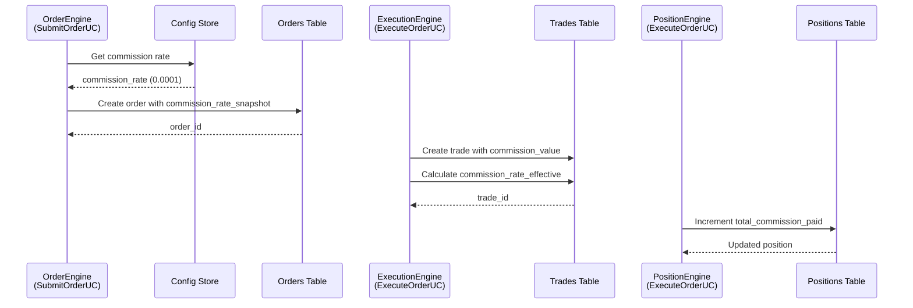
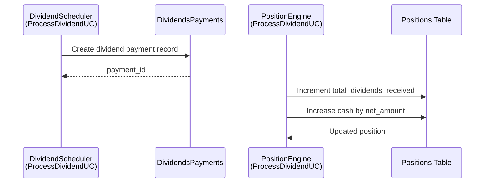

# Commissions and Dividends Architecture

**Date**: January 2025  
**Status**: ✅ Implemented  
**Purpose**: Architecture documentation for commissions and dividends handling

---

## Overview

The system implements a clean separation between configuration, orders, executions (trades), and position aggregates for commissions and dividends, following the Commissions and Dividends Specification.

---

## Architecture Principles

1. **Config is separate from state**: Commission rates live in Config store, not in trading logic
2. **Orders express intent**: Orders store commission rate snapshot and optional estimate
3. **Trades express reality**: Trades store actual commission paid and effective rate
4. **Positions are derived state**: Positions aggregate commissions and dividends from trades and dividend payments

---

## Data Model

### Config Store

**Location**: `backend/domain/ports/config_repo.py`, `backend/infrastructure/persistence/memory/config_repo_mem.py`

**Purpose**: Centralized commission rate management with hierarchical lookup:
- GLOBAL → Default rate (0.0001 = 0.01%)
- TENANT → Tenant-specific rate (future)
- TENANT_ASSET → Asset-specific rate (future)

**Current Implementation**: In-memory with default global rate

### Orders Table

**Fields Added**:
- `commission_rate_snapshot`: Rate copied from config at order creation
- `commission_estimated`: Optional estimate for UI

**Invariant**: Orders never store actual commission paid, only snapshot rate and estimate

### Trades Table (Executions)

**Fields Added**:
- `commission_rate_effective`: Actual rate applied by broker (may differ from order snapshot)
- `status`: Trade status (executed, partially_executed, cancelled, expired)

**Invariant**: All actual commission amounts live in Trades and are aggregated into Positions

### Positions Table

**Fields Added**:
- `total_commission_paid`: Cumulative commission paid
- `total_dividends_received`: Cumulative dividends received

**Invariant**: Position aggregates are always reconstructible from Trades and DividendsPayments

---

## Event Flow

### Commission Flow



### Dividend Flow



---

## Service Responsibilities

### OrderEngine (SubmitOrderUC)

- ✅ Reads commission rate from Config store
- ✅ Stores `commission_rate_snapshot` in Order
- ✅ Optionally calculates `commission_estimated`
- ❌ Does NOT compute actual commissions

### ExecutionEngine (ExecuteOrderUC)

- ✅ Calculates actual `commission_value` for each trade
- ✅ Calculates `commission_rate_effective`
- ✅ Writes Trades with commission fields
- ✅ Increments `position.total_commission_paid`
- ✅ Emits ExecutionEvent

### PositionEngine (ExecuteOrderUC, ProcessDividendUC)

- ✅ Consumes ExecutionEvent and DividendPaidEvent
- ✅ Updates Positions: quantity, avg_cost, total_commission_paid, total_dividends_received
- ✅ Updates cash balance
- ✅ Emits PositionUpdatedEvent

### DividendScheduler (ProcessDividendUC)

- ✅ Manages dividend payments
- ✅ Updates Positions with dividend aggregates
- ✅ Emits DividendPaidEvent

---

## Implementation Details

### Config Store Lookup

```python
# Hierarchical lookup
rate = config_repo.get_commission_rate(
    tenant_id=None,  # Future
    asset_id=pos.ticker,
)
# Returns: TENANT_ASSET → TENANT → GLOBAL (default 0.0001)
```

### Commission Calculation

```python
# In ExecuteOrderUC
notional = qty * price
commission = notional * order.commission_rate_snapshot
commission_rate_effective = commission / notional if notional > 0 else None

# Update position
position.total_commission_paid += commission
```

### Dividend Aggregation

```python
# In ProcessDividendUC
net_amount = float(receivable.net_amount)
position.clear_dividend_receivable(net_amount)
position.total_dividends_received += net_amount
```

---

## Analytics

Position aggregates enable:
- **Fee drag**: `total_commission_paid / total_value` over time
- **Net vs gross performance**: Price return vs total return (including dividends)
- **Commission breakdown**: Per asset, per strategy, per period
- **Dividend yield**: `total_dividends_received / total_value`

---

## Related Documentation

- [Commissions & Dividends Review](backend/docs/COMMISSIONS_DIVIDENDS_REVIEW.md) - Specification review
- [Commissions & Dividends Implementation](backend/docs/COMMISSIONS_DIVIDENDS_IMPLEMENTATION.md) - Implementation details
- [Clean Architecture Overview](clean_architecture_overview.md) - Overall architecture

---

**Last Updated**: January 2025  
**Status**: Implementation Complete


