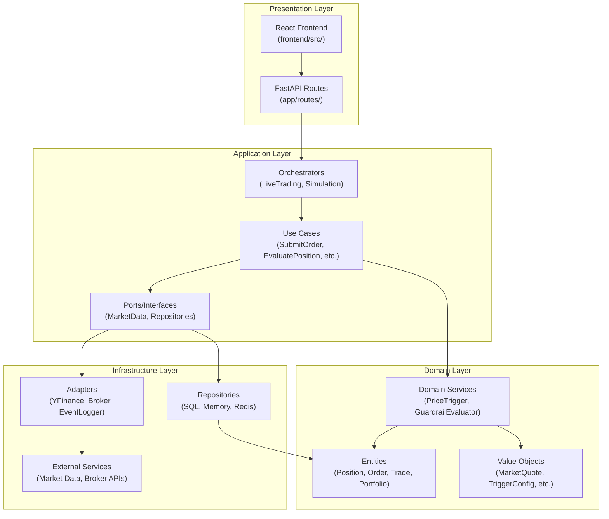
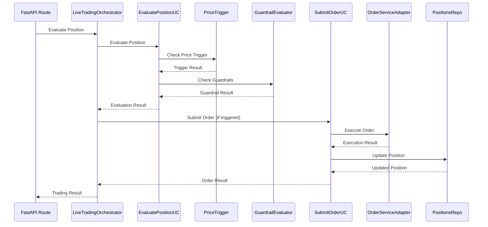
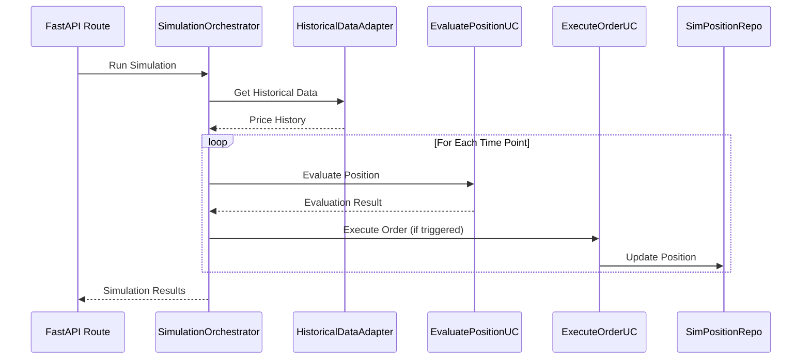

# Component Architecture

**Last Updated:** 2025-01-27  
**Purpose:** Detailed component relationships and dependencies in the Volatility Balancing system

---

## Overview

The Volatility Balancing system follows **Clean Architecture** principles with clear separation of concerns across four main layers:

1. **Presentation Layer** - API routes and UI
2. **Application Layer** - Use cases and orchestration
3. **Domain Layer** - Business logic and entities
4. **Infrastructure Layer** - External adapters and implementations

---

## Architecture Layers

### High-Level Component Diagram



**Dependency Rule:** Dependencies point inward. Domain has no dependencies on outer layers.

---

## Component Details by Layer

### 1. Presentation Layer

**Location:** `backend/app/`, `frontend/src/`

#### FastAPI Routes (`backend/app/routes/`)

- **Portfolio Routes** - Portfolio CRUD operations
- **Position Routes** - Position management
- **Order Routes** - Order submission and querying
- **Trade Routes** - Trade history
- **Simulation Routes** - Backtesting endpoints
- **Optimization Routes** - Parameter optimization endpoints
- **Export Routes** - Excel export functionality

**Responsibilities:**

- HTTP request/response handling
- Request validation (Pydantic models)
- Dependency injection setup
- Error handling and status codes

#### React Frontend (`frontend/src/`)

- **Pages** - Main application pages (Dashboard, Positions, Trading, etc.)
- **Components** - Reusable UI components
- **Hooks** - Custom React hooks for data fetching
- **Types** - TypeScript type definitions

---

### 2. Application Layer

**Location:** `backend/application/`

#### Orchestrators (`application/orchestrators/`)

**LiveTradingOrchestrator**

- Coordinates live trading cycles
- Manages position evaluation
- Handles order submission and execution
- Integrates with market data and event logging

**SimulationOrchestrator**

- Coordinates backtesting simulations
- Manages historical data processing
- Handles simulated order execution
- Tracks simulation results

**Responsibilities:**

- High-level workflow orchestration
- Coordinating multiple use cases
- Managing transaction boundaries
- Error recovery

#### Use Cases (`application/use_cases/`)

**SubmitOrderUC**

- Validates order requests
- Checks guardrails
- Creates order entities
- Persists orders

**EvaluatePositionUC**

- Evaluates price triggers
- Checks guardrail constraints
- Determines if trading action needed
- Returns evaluation results

**ExecuteOrderUC**

- Executes orders via broker adapter
- Records trades
- Updates positions
- Logs events

**ProcessDividendUC**

- Processes dividend events
- Updates position anchor prices
- Records dividend transactions

**ParameterOptimizationUC**

- Manages optimization runs
- Coordinates parameter sweeps
- Calculates optimization metrics
- Stores results

**Responsibilities:**

- Single business operation
- Input validation
- Business rule enforcement
- Coordination with domain services

#### Ports/Interfaces (`application/ports/`)

**Repository Ports:**

- `PositionsRepo` - Position persistence
- `PortfolioRepo` - Portfolio persistence
- `OrdersRepo` - Order persistence
- `TradesRepo` - Trade persistence
- `EventsRepo` - Event logging
- `MarketDataRepo` - Market data access
- `DividendRepo` - Dividend data
- `ConfigRepo` - Configuration storage

**Service Ports:**

- `MarketDataPort` - Market data interface
- `OrderServicePort` - Order execution interface
- `EventLoggerPort` - Event logging interface

**Responsibilities:**

- Define contracts for infrastructure
- Enable dependency inversion
- Support testing with mocks

#### Services (`application/services/`)

**Helper Services:**

- Position calculation services
- Performance calculation services
- Data transformation services

---

### 3. Domain Layer

**Location:** `backend/domain/`

#### Entities (`domain/entities/`)

**Position**

- Represents a trading position (cash + stock)
- Tracks quantity, anchor price, trigger config
- Encapsulates position state

**Order**

- Represents a trade order
- Tracks order type (BUY/SELL), quantity, status
- Links to position and portfolio

**Trade**

- Represents an executed trade
- Records execution price, commission, timestamp
- Links to order and position

**Portfolio**

- Represents a trading portfolio
- Contains multiple positions
- Tracks portfolio-level state

**Dividend**

- Represents dividend events
- Tracks ex-dividend dates, amounts
- Links to positions

**Responsibilities:**

- Encapsulate business logic
- Maintain invariants
- No external dependencies

#### Value Objects (`domain/value_objects/`)

**MarketQuote**

- Price, volume, timestamp
- Immutable price data

**TriggerConfig**

- Trigger thresholds (buy/sell percentages)
- Rebalance ratio
- Immutable configuration

**GuardrailConfig**

- Asset percentage bounds
- Max trade size
- Risk constraints

**OrderPolicyConfig**

- Order execution policies
- Market hours configuration

**Responsibilities:**

- Represent domain concepts
- Immutable
- Value equality

#### Domain Services (`domain/services/`)

**PriceTrigger**

- Evaluates price triggers
- Determines if buy/sell threshold met
- Pure function (no side effects)

**GuardrailEvaluator**

- Evaluates guardrail constraints
- Checks asset percentage bounds
- Validates trade sizes
- Pure function (no side effects)

**Responsibilities:**

- Domain logic that doesn't belong to entities
- Stateless operations
- Pure functions (testable)

---

### 4. Infrastructure Layer

**Location:** `backend/infrastructure/`

#### Repositories (`infrastructure/persistence/`)

**SQL Repositories:**

- `SQLPositionsRepo` - PostgreSQL/SQLite persistence
- `SQLPortfolioRepo` - Portfolio persistence
- `SQLOrdersRepo` - Order persistence
- `SQLTradesRepo` - Trade persistence
- `SQLEventsRepo` - Event logging

**Memory Repositories:**

- `InMemoryPositionsRepo` - In-memory storage (testing)
- `InMemoryOrdersRepo` - In-memory storage
- `InMemoryTradesRepo` - In-memory storage

**Redis Repositories:**

- `RedisIdempotencyRepo` - Idempotency key storage

**Responsibilities:**

- Implement repository ports
- Handle persistence details
- Manage database connections
- Data transformation (entity ↔ database)

#### Adapters (`infrastructure/adapters/`)

**Market Data Adapters:**

- `YFinanceMarketDataAdapter` - Yahoo Finance integration
- `HistoricalDataAdapter` - Historical data access

**Order Service Adapters:**

- `LiveOrderServiceAdapter` - Live broker integration
- `SimOrderServiceAdapter` - Simulated execution

**Event Logger Adapter:**

- `EventLoggerAdapter` - Event logging implementation

**Position Repo Adapters:**

- `PositionRepoAdapter` - Position repository wrapper
- `SimPositionRepoAdapter` - Simulation-specific adapter

**Responsibilities:**

- Implement application ports
- Handle external service integration
- Error handling and retries
- Data transformation

#### External Services

**Market Data:**

- YFinance API - Real-time and historical prices
- Dividend data sources

**Broker APIs:**

- Order execution (future: multiple brokers)

**Storage:**

- PostgreSQL/SQLite - Primary database
- Redis - Caching and idempotency
- File system - Excel exports

---

## Component Interaction Flow

### Trading Cycle Flow



### Simulation Flow



---

## Dependency Injection

The system uses dependency injection (see `backend/app/di.py`) to:

- Wire up components
- Swap implementations (SQL vs Memory repos)
- Enable testing with mocks
- Manage lifecycle (singletons, request-scoped)

**Key Container:**

- `_Container` class manages all dependencies
- Routes get dependencies via FastAPI's dependency injection
- Supports multiple persistence backends

---

## Component Relationships

### Repository Pattern

```
Application Layer (Use Cases)
    ↓ (depends on)
Ports (Interfaces)
    ↓ (implemented by)
Infrastructure Layer (Repositories)
    ↓ (persists)
Domain Entities
```

### Adapter Pattern

```
Application Layer (Orchestrators)
    ↓ (depends on)
Ports (Service Interfaces)
    ↓ (implemented by)
Infrastructure Layer (Adapters)
    ↓ (calls)
External Services
```

### Domain Services

```
Application Layer (Use Cases)
    ↓ (uses)
Domain Services (Pure Functions)
    ↓ (operates on)
Domain Entities & Value Objects
```

---

## Key Design Principles

### 1. Dependency Inversion

- Application layer depends on ports (interfaces), not implementations
- Infrastructure implements ports
- Enables easy swapping of implementations

### 2. Single Responsibility

- Each component has one clear responsibility
- Use cases handle single business operations
- Domain services handle specific domain logic

### 3. Separation of Concerns

- Presentation: HTTP handling
- Application: Orchestration and use cases
- Domain: Business logic
- Infrastructure: Technical details

### 4. Testability

- Domain layer is easily testable (pure functions)
- Use cases testable with mock repositories
- Infrastructure testable in isolation

---

## Component Organization

### Backend Structure

```
backend/
├── app/                    # Presentation Layer
│   ├── routes/            # API endpoints
│   ├── di.py             # Dependency injection
│   └── main.py           # FastAPI app
│
├── application/           # Application Layer
│   ├── orchestrators/    # High-level orchestration
│   ├── use_cases/        # Business operations
│   ├── ports/            # Interfaces
│   ├── services/         # Application services
│   └── dto/              # Data transfer objects
│
├── domain/                # Domain Layer
│   ├── entities/         # Business entities
│   ├── value_objects/    # Value objects
│   ├── services/        # Domain services
│   └── ports/            # Domain interfaces
│
└── infrastructure/        # Infrastructure Layer
    ├── persistence/     # Repositories
    ├── adapters/         # External adapters
    ├── market/           # Market data
    └── time/             # Time utilities
```

### Frontend Structure

```
frontend/src/
├── pages/                # Page components
├── components/           # Reusable components
├── hooks/                # Custom hooks
├── types/                # TypeScript types
└── services/             # API clients
```

---

## Related Documentation

- [Clean Architecture Overview](clean_architecture_overview.md) - Architectural principles
- [Domain Model](domain-model.md) - Domain entities and concepts
- [Trading Cycle](trading-cycle.md) - Trading flow details
- [Persistence](persistence.md) - Database schema
- [System Context](context.md) - High-level system view

---

_Last updated: 2025-01-27_


