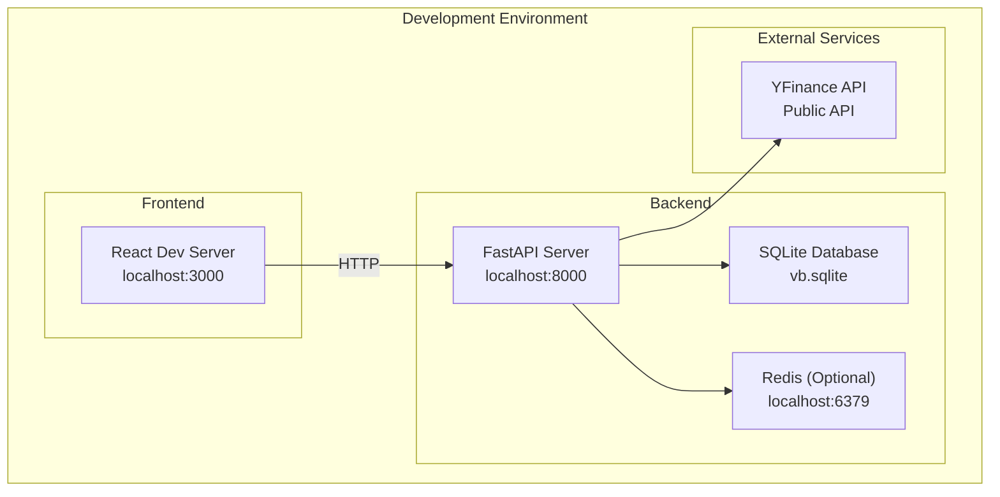
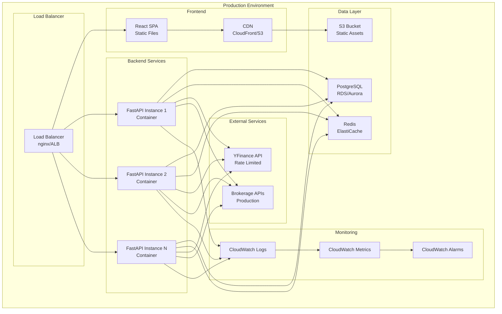
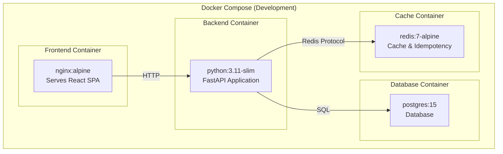
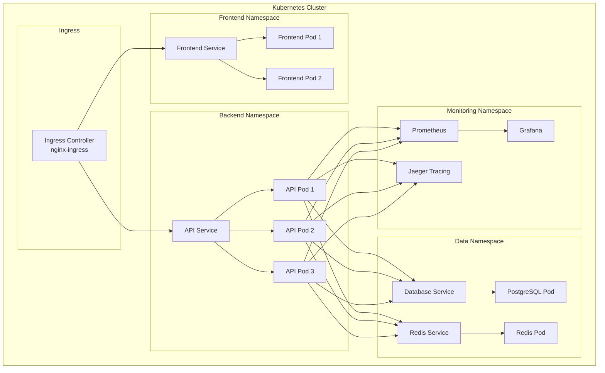
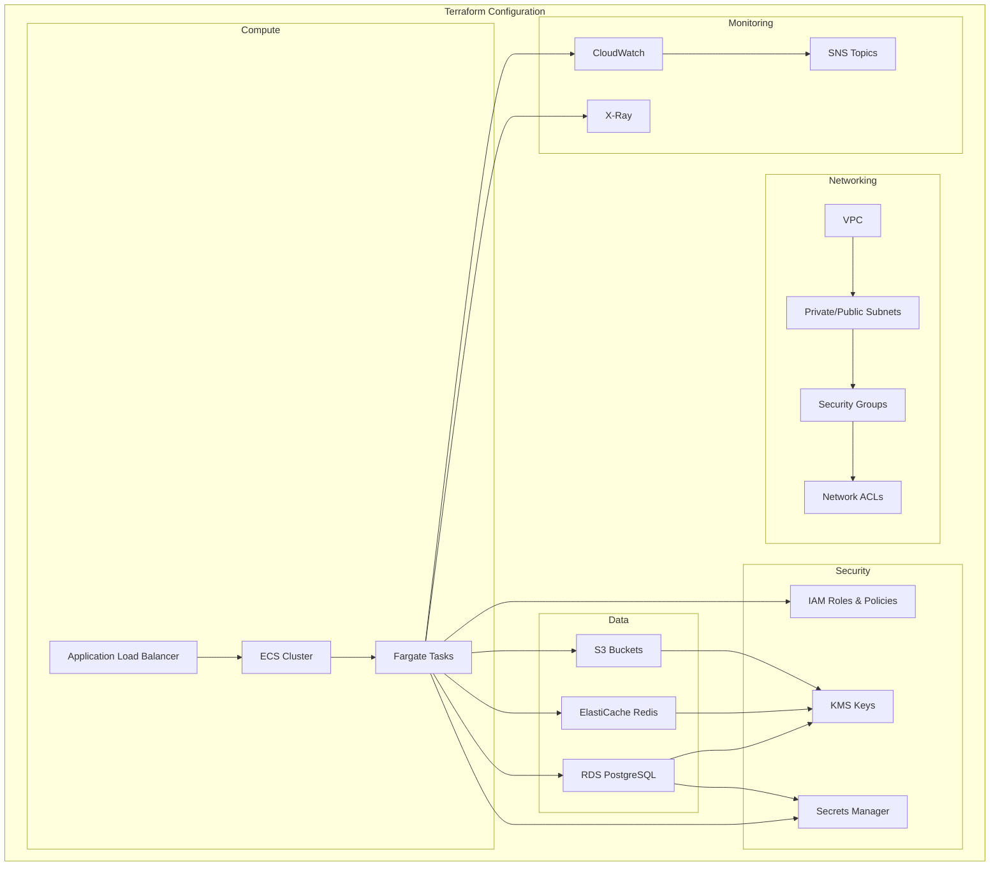

# Deployment Architecture

This document describes the deployment architecture for the Volatility Balancing system.

## Development Environment

## Production Environment

## Container Architecture

## Kubernetes Deployment

## Infrastructure as Code

## Environment Configuration

### Development

- **Frontend**: React dev server with hot reload
- **Backend**: FastAPI with auto-reload
- **Database**: SQLite for simplicity
- **Cache**: Optional Redis for testing
- **External**: YFinance API (rate limited)

### Staging

- **Frontend**: Static build served by nginx
- **Backend**: FastAPI in Docker container
- **Database**: PostgreSQL on RDS
- **Cache**: Redis on ElastiCache
- **External**: YFinance API + Broker sandbox

### Production

- **Frontend**: CDN-distributed static files
- **Backend**: Multiple FastAPI instances behind load balancer
- **Database**: PostgreSQL on RDS with read replicas
- **Cache**: Redis cluster on ElastiCache
- **External**: YFinance API + Production broker APIs
- **Monitoring**: Full observability stack

## Security Considerations

### Network Security

- VPC with private subnets for backend services
- Public subnets only for load balancers
- Security groups with least privilege access
- WAF for additional protection

### Data Security

- Encryption at rest for all data stores
- Encryption in transit (TLS 1.3)
- Secrets managed through AWS Secrets Manager
- Regular security updates and patches

### Application Security

- Input validation and sanitization
- Rate limiting and DDoS protection
- Idempotency keys for order deduplication
- Audit trails for all operations

## Scalability

### Horizontal Scaling

- Stateless backend services
- Load balancer distribution
- Database read replicas
- Redis cluster mode

### Vertical Scaling

- Auto-scaling groups for backend
- Database instance scaling
- Cache memory scaling
- CDN for global distribution

## Disaster Recovery

### Backup Strategy

- Automated database backups
- Cross-region replication
- Point-in-time recovery
- Configuration backup

### Recovery Procedures

- RTO: 4 hours for full recovery
- RPO: 1 hour maximum data loss
- Automated failover for critical services
- Manual procedures for complex scenarios
