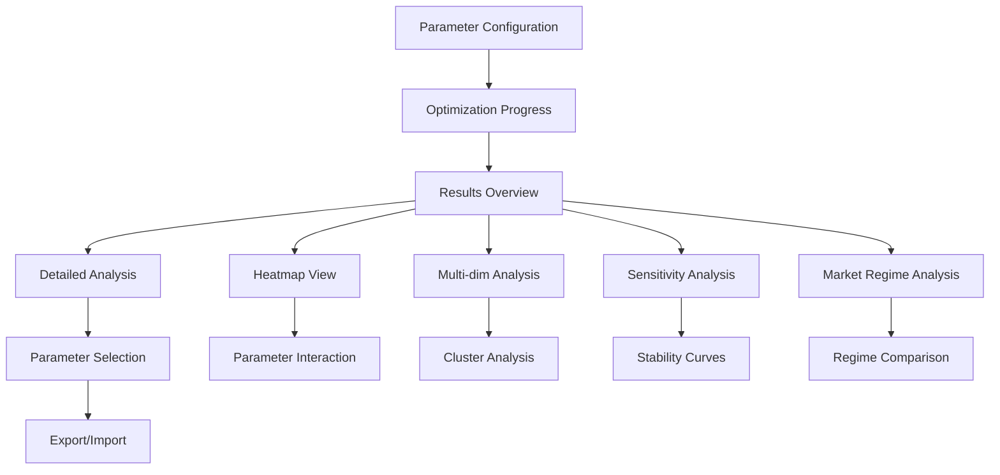

# Parameter Optimization Visualization — Technical Specification

## 1. Overview

This document specifies the visualization requirements and technical implementation for the Parameter Optimization System. The visualization components enable users to explore parameter performance landscapes, identify optimal regions, and understand parameter interactions through interactive charts and heatmaps.

**Key Visualization Goals:**

- **Intuitive Parameter Exploration:** Easy-to-use interfaces for navigating parameter spaces
- **Performance Landscape Mapping:** Clear visualization of parameter-performance relationships
- **Multi-dimensional Analysis:** Support for analyzing multiple parameters simultaneously
- **Interactive Exploration:** Real-time filtering, zooming, and parameter selection

## 2. Visualization Components

### 2.1 Parameter Configuration Interface

```typescript
interface ParameterRangeConfig {
  parameter: string;
  displayName: string;
  minValue: number;
  maxValue: number;
  stepSize: number;
  defaultValue: number;
  parameterType: 'continuous' | 'discrete';
  constraints?: {
    minValue?: number;
    maxValue?: number;
    dependencies?: ParameterDependency[];
  };
}

interface ParameterDependency {
  parameter: string;
  condition: 'greater_than' | 'less_than' | 'equals';
  value: number;
  message: string;
}
```

**UI Components:**

- **Range Sliders:** For continuous parameters with real-time validation
- **Step Inputs:** For precise parameter value entry
- **Constraint Indicators:** Visual warnings for invalid parameter combinations
- **Dependency Visualization:** Show parameter relationships and constraints

### 2.2 Optimization Progress Dashboard

```typescript
interface OptimizationProgress {
  configId: string;
  status: 'pending' | 'running' | 'completed' | 'failed' | 'paused';
  totalCombinations: number;
  completedCombinations: number;
  failedCombinations: number;
  currentCombination: ParameterCombination | null;
  progressPercentage: number;
  estimatedCompletion: Date | null;
  startTime: Date;
  elapsedTime: number;
  averageTimePerCombination: number;
}

interface ParameterCombination {
  index: number;
  parameters: Record<string, number>;
  status: 'pending' | 'running' | 'completed' | 'failed';
  performanceMetrics?: PerformanceMetrics;
}
```

**UI Components:**

- **Progress Bar:** Overall completion percentage with time estimates
- **Status Grid:** Individual parameter combination status
- **Performance Preview:** Real-time performance metrics for completed combinations
- **Control Panel:** Start, pause, resume, and cancel optimization

### 2.3 Performance Heatmaps

```typescript
interface HeatmapData {
  xParameter: string;
  yParameter: string;
  metric: string;
  xValues: number[];
  yValues: number[];
  zValues: number[][]; // 2D array of metric values
  metadata: {
    minValue: number;
    maxValue: number;
    meanValue: number;
    stdValue: number;
    dataPoints: number;
  };
}

interface HeatmapConfig {
  colorScheme: 'viridis' | 'plasma' | 'inferno' | 'magma' | 'custom';
  interpolation: 'linear' | 'cubic' | 'nearest';
  showContours: boolean;
  showDataPoints: boolean;
  logScale: boolean;
}
```

**Visualization Features:**

- **Interactive Heatmaps:** 2D parameter space visualization with hover details
- **Color Mapping:** Configurable color schemes for different performance metrics
- **Contour Lines:** Optional contour overlays for performance level curves
- **Data Point Overlay:** Show individual parameter combinations on heatmap
- **Zoom and Pan:** Navigate large parameter spaces efficiently
- **Metric Selection:** Switch between different performance metrics (Sharpe, return, drawdown)

### 2.4 Multi-dimensional Analysis

```typescript
interface MultiDimAnalysis {
  parameters: string[];
  metric: string;
  analysisType: 'parallel_coordinates' | 'radar_chart' | 'scatter_matrix';
  data: MultiDimDataPoint[];
  clusters?: ClusterAnalysis;
  correlations?: CorrelationMatrix;
}

interface MultiDimDataPoint {
  parameters: Record<string, number>;
  performance: number;
  rank: number;
  cluster?: number;
  marketRegime?: string;
}

interface ClusterAnalysis {
  clusters: Cluster[];
  silhouetteScore: number;
  optimalClusters: number;
}

interface Cluster {
  id: number;
  centroid: Record<string, number>;
  size: number;
  averagePerformance: number;
  parameterRanges: Record<string, [number, number]>;
}
```

**Visualization Components:**

- **Parallel Coordinates:** Multi-parameter visualization with performance coloring
- **Radar Charts:** Parameter profile comparison for top-performing combinations
- **Scatter Matrix:** Pairwise parameter relationships and correlations
- **Cluster Analysis:** Automatic grouping of similar parameter combinations
- **3D Scatter Plots:** Three-parameter visualization with performance as color/size

### 2.5 Parameter Sensitivity Analysis

```typescript
interface SensitivityAnalysis {
  parameterSensitivity: Record<string, number>; // Parameter -> sensitivity score
  interactionEffects: ParameterInteraction[];
  stabilityAnalysis: ParameterStability;
  optimalRanges: Record<string, [number, number]>;
}

interface ParameterInteraction {
  parameter1: string;
  parameter2: string;
  interactionStrength: number;
  interactionType: 'synergistic' | 'antagonistic' | 'neutral';
  significance: number;
}

interface ParameterStability {
  parameter: string;
  stabilityScore: number; // 0-1, higher is more stable
  optimalRange: [number, number];
  sensitivityCurve: { value: number; performance: number }[];
}
```

**Visualization Features:**

- **Sensitivity Bar Chart:** Rank parameters by their impact on performance
- **Interaction Heatmap:** Show parameter interaction strengths and types
- **Stability Curves:** Line charts showing parameter sensitivity across ranges
- **Optimal Range Highlighting:** Visual indication of stable parameter ranges

### 2.6 Market Regime Analysis

```typescript
interface MarketRegimeAnalysis {
  regimes: MarketRegime[];
  regimePerformance: Record<string, RegimePerformance>;
  regimeTransitions: RegimeTransition[];
  parameterStability: Record<string, RegimeStability>;
}

interface MarketRegime {
  name: string;
  description: string;
  dateRange: [Date, Date];
  characteristics: Record<string, number>;
  parameterPerformance: Record<string, number>;
}

interface RegimePerformance {
  regime: string;
  averagePerformance: number;
  performanceStd: number;
  bestParameters: Record<string, number>;
  parameterStability: Record<string, number>;
}

interface RegimeTransition {
  fromRegime: string;
  toRegime: string;
  transitionDate: Date;
  parameterChanges: Record<string, number>;
}
```

**Visualization Components:**

- **Regime Timeline:** Time series showing market regime changes
- **Regime Performance Comparison:** Bar charts comparing performance across regimes
- **Parameter Stability Heatmap:** Show how parameters perform across different regimes
- **Transition Analysis:** Visualize parameter changes during regime transitions

## 3. Technical Implementation

### 3.1 Frontend Architecture

```typescript
// Main optimization dashboard component
interface OptimizationDashboardProps {
  configId: string;
  onParameterSelect: (parameters: Record<string, number>) => void;
  onOptimizationStart: (config: OptimizationConfig) => void;
  onOptimizationStop: (configId: string) => void;
}

// Heatmap visualization component
interface ParameterHeatmapProps {
  data: HeatmapData;
  config: HeatmapConfig;
  onPointClick: (x: number, y: number, parameters: Record<string, number>) => void;
  onParameterChange: (xParam: string, yParam: string) => void;
  onMetricChange: (metric: string) => void;
}

// Multi-dimensional analysis component
interface MultiDimAnalysisProps {
  data: MultiDimAnalysis;
  analysisType: 'parallel_coordinates' | 'radar_chart' | 'scatter_matrix';
  onDataPointSelect: (point: MultiDimDataPoint) => void;
  onClusterToggle: (clusterId: number) => void;
}
```

### 3.2 Data Processing Pipeline

```typescript
// Data transformation utilities
class OptimizationDataProcessor {
  // Convert raw optimization results to heatmap data
  static generateHeatmapData(
    results: OptimizationResult[],
    xParam: string,
    yParam: string,
    metric: string,
  ): HeatmapData;

  // Generate multi-dimensional analysis data
  static generateMultiDimAnalysis(
    results: OptimizationResult[],
    parameters: string[],
    metric: string,
  ): MultiDimAnalysis;

  // Calculate parameter sensitivity scores
  static calculateSensitivity(
    results: OptimizationResult[],
    parameters: string[],
  ): SensitivityAnalysis;

  // Detect market regimes and analyze performance
  static analyzeMarketRegimes(
    results: OptimizationResult[],
    priceData: MarketData[],
  ): MarketRegimeAnalysis;
}
```

### 3.3 Visualization Libraries

**Primary Libraries:**

- **D3.js:** Custom visualizations and complex interactions
- **Recharts:** Standard charts (bar, line, scatter)
- **Plotly.js:** 3D plots and advanced statistical visualizations
- **React-Color:** Color picker for custom color schemes

**Chart Types:**

- **Heatmaps:** Custom D3.js implementation for parameter spaces
- **Parallel Coordinates:** Custom D3.js implementation
- **3D Scatter Plots:** Plotly.js for three-parameter visualization
- **Standard Charts:** Recharts for performance comparisons and trends

### 3.4 Performance Optimization

**Data Management:**

- **Virtual Scrolling:** Handle large datasets efficiently
- **Data Aggregation:** Pre-compute common visualizations
- **Caching:** Cache processed visualization data
- **Lazy Loading:** Load visualization data on demand

**Rendering Optimization:**

- **Canvas Rendering:** Use Canvas for large heatmaps
- **WebGL:** 3D visualizations with WebGL
- **Debounced Updates:** Prevent excessive re-rendering
- **Memory Management:** Clean up large datasets

## 4. User Experience Design

### 4.1 Navigation Flow



### 4.2 Responsive Design

**Desktop (1200px+):**

- Full dashboard with all visualizations visible
- Side-by-side parameter configuration and results
- Large heatmaps with detailed interactions

**Tablet (768px-1199px):**

- Tabbed interface for different analysis views
- Collapsible parameter configuration panel
- Optimized heatmap sizing

**Mobile (320px-767px):**

- Single-view interface with navigation tabs
- Simplified parameter configuration
- Touch-optimized controls

### 4.3 Accessibility

**Keyboard Navigation:**

- Full keyboard support for all interactions
- Tab order optimization for logical flow
- Keyboard shortcuts for common actions

**Screen Reader Support:**

- ARIA labels for all interactive elements
- Descriptive alt text for visualizations
- Data table alternatives for chart data

**Visual Accessibility:**

- High contrast color schemes
- Colorblind-friendly palettes
- Adjustable font sizes and zoom levels

## 5. Data Export and Sharing

### 5.1 Export Formats

```typescript
interface ExportOptions {
  format: 'csv' | 'json' | 'excel' | 'pdf';
  includeVisualizations: boolean;
  includeRawData: boolean;
  includeAnalysis: boolean;
  compression: boolean;
}

interface ExportData {
  optimizationConfig: OptimizationConfig;
  results: OptimizationResult[];
  visualizations: VisualizationData[];
  analysis: AnalysisResults;
  metadata: ExportMetadata;
}
```

**Export Capabilities:**

- **CSV Export:** Raw parameter combinations and performance data
- **JSON Export:** Complete optimization results with metadata
- **Excel Export:** Formatted spreadsheets with multiple sheets
- **PDF Export:** Report generation with visualizations
- **Image Export:** High-resolution visualization images

### 5.2 Sharing and Collaboration

```typescript
interface ShareOptions {
  shareType: 'public' | 'private' | 'team';
  permissions: SharePermissions;
  expirationDate?: Date;
  includeData: boolean;
  includeVisualizations: boolean;
}

interface SharePermissions {
  canView: boolean;
  canDownload: boolean;
  canModify: boolean;
  canShare: boolean;
}
```

**Sharing Features:**

- **Public Links:** Shareable URLs for optimization results
- **Team Collaboration:** Share within organization
- **Permission Control:** Granular access control
- **Version History:** Track changes and iterations

## 6. Future Enhancements

### 6.1 Advanced Visualizations

- **Interactive 3D Parameter Spaces:** WebGL-based 3D exploration
- **Animated Transitions:** Smooth transitions between parameter views
- **Real-time Updates:** Live optimization progress visualization
- **VR/AR Support:** Immersive parameter space exploration

### 6.2 Machine Learning Integration

- **Auto-parameter Discovery:** ML-based parameter space exploration
- **Performance Prediction:** Predict performance for untested parameters
- **Anomaly Detection:** Identify unusual parameter combinations
- **Recommendation Engine:** Suggest parameter ranges based on historical data

### 6.3 Advanced Analytics

- **Statistical Significance Testing:** Validate parameter performance differences
- **Monte Carlo Analysis:** Uncertainty quantification for parameters
- **Robustness Testing:** Parameter stability across different market conditions
- **Cross-validation:** Out-of-sample parameter validation
