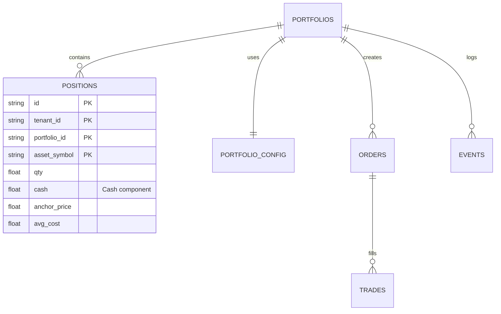

```mermaid
erDiagram
  PORTFOLIOS ||--o{ POSITIONS : contains
  PORTFOLIOS ||--|| PORTFOLIO_CONFIG : uses
  PORTFOLIOS ||--o{ ORDERS : creates
  ORDERS ||--o{ TRADES : fills
  PORTFOLIOS ||--o{ EVENTS : logs
  POSITIONS {
    string id PK
    string tenant_id PK
    string portfolio_id PK
    string asset_symbol PK
    float qty
    float cash "Cash component"
    float anchor_price
    float avg_cost
  }
```

**Note**: Each position is a **position cell** combining cash and stock. Cash is stored in `Position.cash`, not in a separate table.
