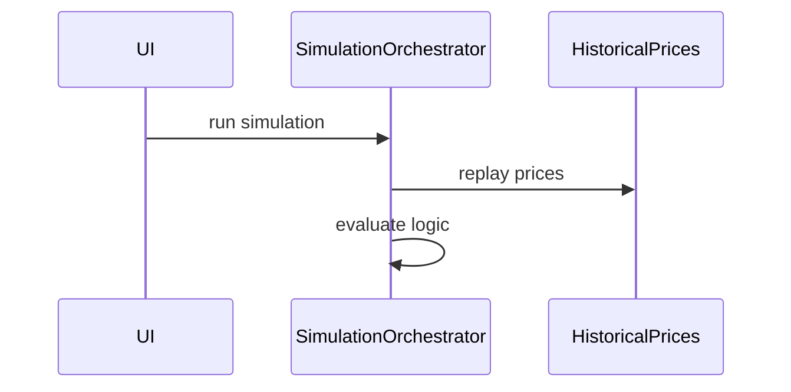

```mermaid
sequenceDiagram
  participant UI
  participant SIM as SimulationOrchestrator
  participant MD as HistoricalPrices

  UI->>SIM: run simulation
  SIM->>MD: replay prices
  SIM->>SIM: evaluate logic
```
