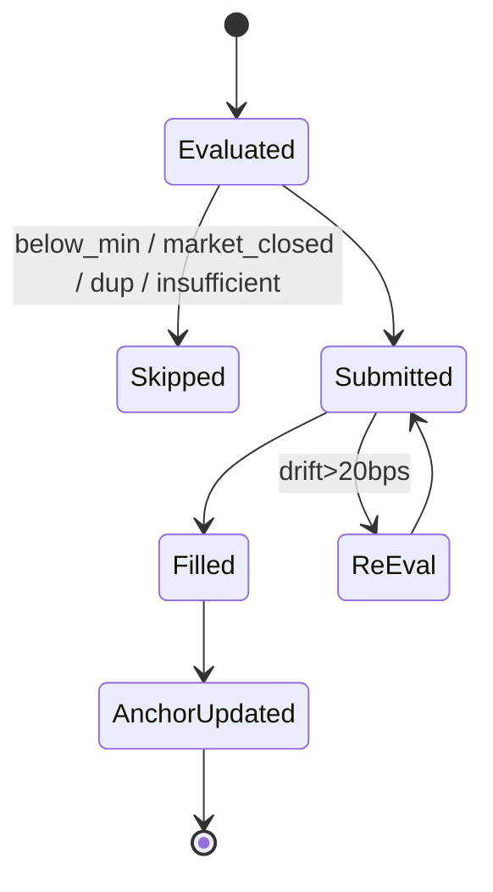
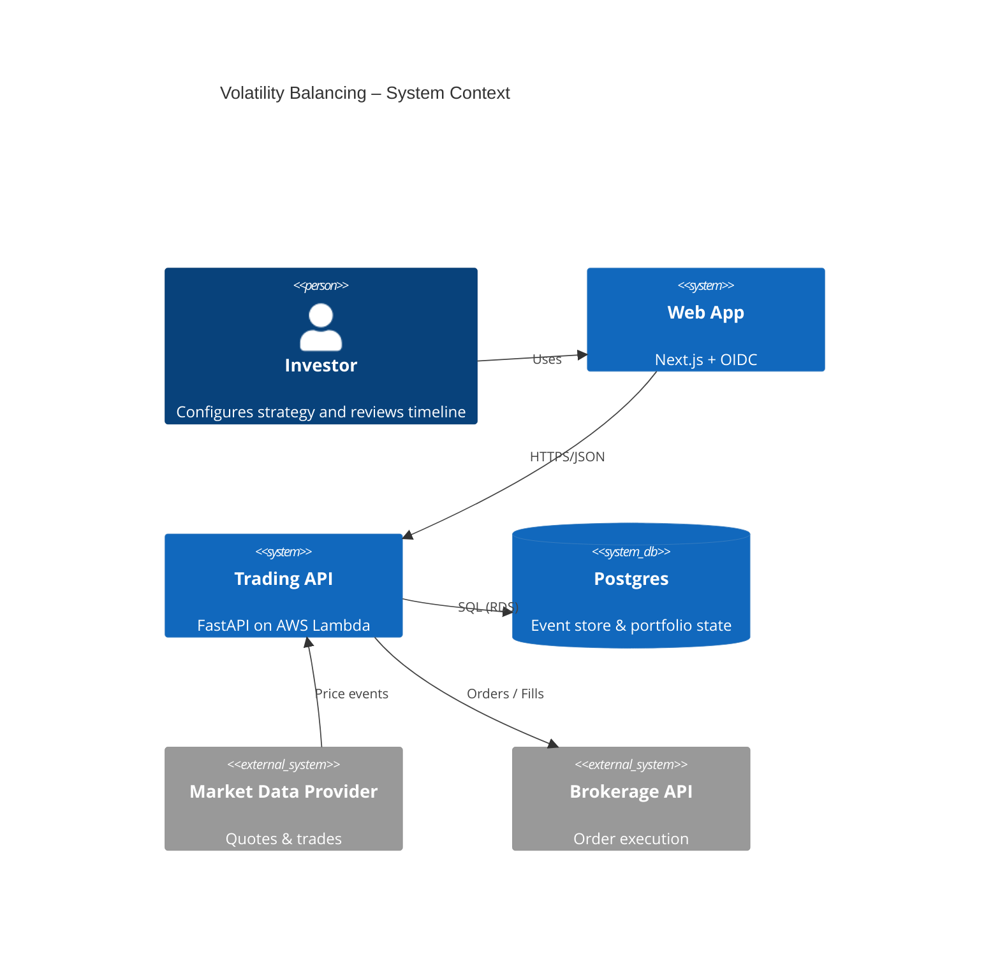

# Volatility Balancing — Architecture v1 (MVP)

> Semi‑passive, rules‑based trading for blue‑chip equities with transparent guardrails and full auditability.

---

## 1) TL;DR
- **Frontend:** Next.js (React) + TypeScript, Tailwind, Recharts. Auth via OAuth2/OIDC (AWS Cognito).
- **Backend:** Python **FastAPI** on AWS Lambda (API Gateway). Modules: Price Feed, Decision Engine, Order Manager, Dividend Handler, Event Store, Reporting.
- **Data:** Postgres (RDS, small/Serverless v2) for portfolios/orders/events; **Redis** (Upstash/ElastiCache) for hot quotes & idempotency; **S3** for audit exports & cold storage.
- **Async:** **EventBridge** (cron + bus) → **SQS** queues → **Lambda** workers. Optional **Step Functions** for order lifecycle.
- **Integrations:** Market data & brokerage adapters (paper first; pluggable vendor SDKs).
- **Security:** Cognito, IAM least‑privilege, KMS‑encrypted storage, Secrets Manager, VPC, TLS‑only.

---

## 2) Component Model
```mermaid
flowchart LR
  subgraph Frontend
    WEB["Next.js App\\nConfig / Positions / Timeline"]
  end

  subgraph Identity
    COG[Cognito OIDC]
  end

  WEB -->|OIDC| COG
  WEB -->|HTTPS JSON| APIG[API Gateway]

  subgraph Backend (Serverless FastAPI)
    API[FastAPI Router]
    DEC[Decision Engine]
    ORD[Order Manager]
    DIV[Dividend Handler]
    RPT[Reporting]
  end

  APIG --> API
  API -->|emit events| EVT(EventBridge Bus)
  EVT -->|PriceEvent| DEC
  EVT -->|ExDivEvent| DIV
  DEC -->|OrderIntent| ORD

  subgraph Async Queues
    Q1[SQS: price-events]
    Q2[SQS: orders]
    Q3[SQS: dividends]
  end

  EVT --> Q1
  Q1 --> DEC
  DEC --> Q2
  DIV --> Q3
  Q2 --> ORD

  subgraph Data
    PG[(RDS Postgres)]
    S3[(S3 Audit/Exports)]
    REDIS[(Redis: cache/idempotency)]
  end

  API <--> PG
  DEC <--> PG
  ORD <--> PG
  ORD <--> REDIS
  RPT --> S3

  subgraph Integrations
    MKT[Market Data Adapter]
    BRK[Brokerage Adapter]
  end

  MKT --> EVT
  ORD <--> BRK
```

---

## 3) Core Sequence (Tick → Trade)
```mermaid
sequenceDiagram
  participant MD as Market Data
  participant DEC as Decision Engine (Lambda)
  participant ORD as Order Manager (Lambda)
  participant BRK as Brokerage API
  participant DB as Postgres

  MD->>DEC: PriceEvent{symbol, last, mid, age}
  DEC->>DB: Load Position & Config
  DEC->>DEC: Evaluate triggers; size order; trim to guardrails
  alt Below min_notional or invalid
    DEC-->>DB: Write Event(reason="skip")
  else Send order
    DEC-->>DB: Write Event(order_intent)
    DEC->>ORD: OrderIntent{idempotency_key}
    ORD->>BRK: Submit order (market/limit)
    BRK-->>ORD: Fill{qty, price}
    ORD->>DB: Update cash/fees/anchor; persist Events
  end
```

---

## 4) Order Lifecycle (State Machine)


---

## 5) Data Model (minimal)
- **portfolios**(id, user_id, settings_json {tau, r, guardrails, min_notional, commission_bps, max_orders_day, withholding, after_hours, fractional})
- **positions**(id, portfolio_id, symbol, shares, anchor_price, cash, receivable, last_order_day_count)
- **orders**(id, position_id, side, qty, price_limit, status, reason, idempotency_key, created_at)
- **executions**(id, order_id, qty, price, commission_bps, notional, slippage_bps, created_at)
- **events**(id, position_id, type, inputs_json, outputs_json, message, created_at)
- **dividends**(id, symbol, ex_date, pay_date, dps, withholding_rate, created_event_id)

**Notes**
- Event store is append‑only; derive metrics & timeline from events.
- Receivable is included in **C_effective = cash + receivable** for sizing/guardrails.

---

## 6) APIs (MVP)
- `GET /positions/{id}` → Position card data (price, anchor, next action, trimmed size, projected %).
- `GET /events?position_id=...` → Timeline entries.
- `POST /positions/{id}/evaluate` → Internal/event‑driven evaluation hook.
- `POST /orders/callback` → Broker webhooks for fills/cancels.
- `GET /metrics` → Slippage, guardrail time %, min_notional skips, turnover, fees.

---

## 7) Async & Sizing Logic (pseudocode)
```python
q_raw = (position.anchor / price) * r * ((A + C_eff) / price)
q = sign * q_raw  # BUY/SELL
q = guardrail_trim(q, price, g_low, g_high)
if abs(q)*price < min_notional: return skip
if BUY and C_eff < q*price: return skip
if SELL and shares < |q|: return skip
```

---

## 8) Security & Compliance
- Cognito (OIDC), AuthZ at API with portfolio/position scoping.
- Secrets in **AWS Secrets Manager**; KMS‑encrypted RDS/S3.
- IAM least privilege; API Gateway WAF; CloudTrail + GuardDuty.
- Per‑tenant brokerage API keys; idempotency keys (`position|ts|side`).
- Audit exports (CSV/Parquet) to S3; no PII beyond config.

---

## 9) Deployment & Cost Posture
- **Serverless‑first**: API Gateway + Lambda + EventBridge + SQS.
- Small RDS instance (or Serverless v2 min ACUs); Redis serverless (Upstash) to stay low‑cost.
- IaC with Terraform; single repo: `apps/web`, `apps/api`, `infra/terraform`.
- Scale‑out path: move Decision/Order workers to Fargate or Lambda provisioned‑concurrency if needed.

---

## 10) Observability
- Structured JSON logs (request_id, position_id, idempotency_key).
- Metrics: slippage_bps, hit_rate, guardrail_time_pct, min_notional_skips, turnover, fee_drag.
- Tracing (X‑Ray) across event flow; dead‑letter queues on SQS.

---

## 11) Open Questions
- Preferred brokerage + market‑data vendors (fractional, corp‑actions, sandbox quality).
- Execution style defaults (market vs. limit) by venue/region.
- Evaluation cadence (tick vs. minute bars) vs. cost/latency trade‑off.

---

## 12) Mermaid: C4‑ish Context View


---

## 13) Non‑Goals (Next Versions)
- Multi‑asset portfolio allocation; dynamic thresholds; DRIP; TWAP; tax‑lot optimization.
