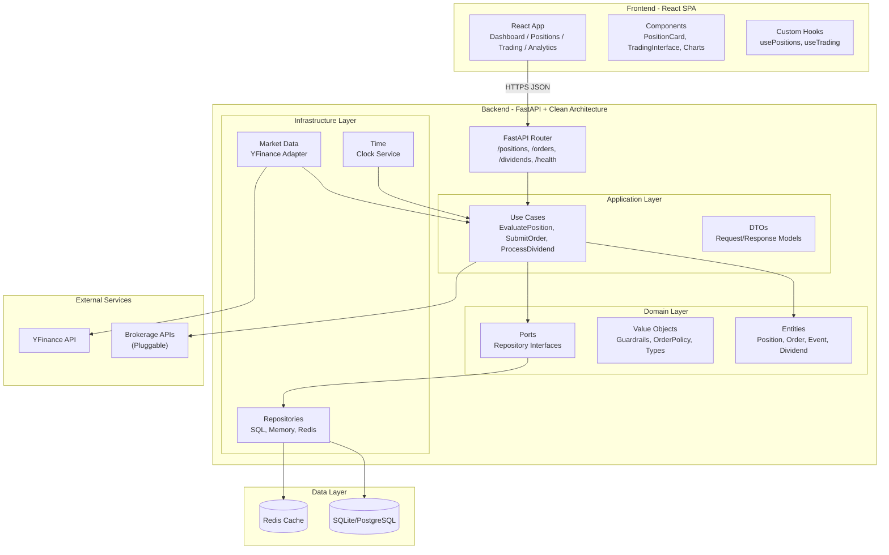
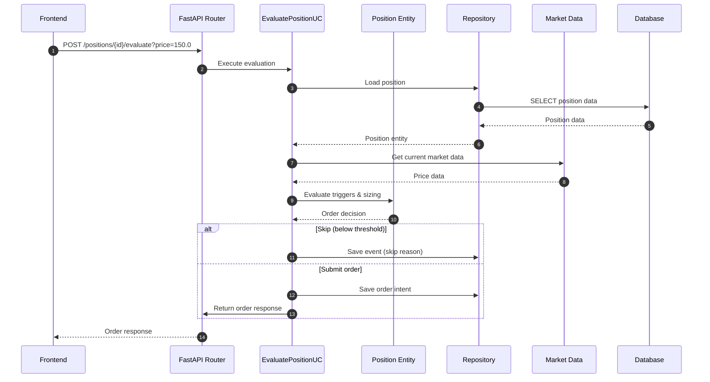
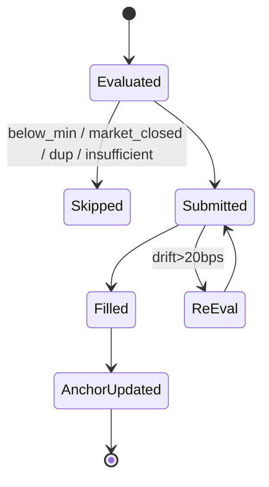
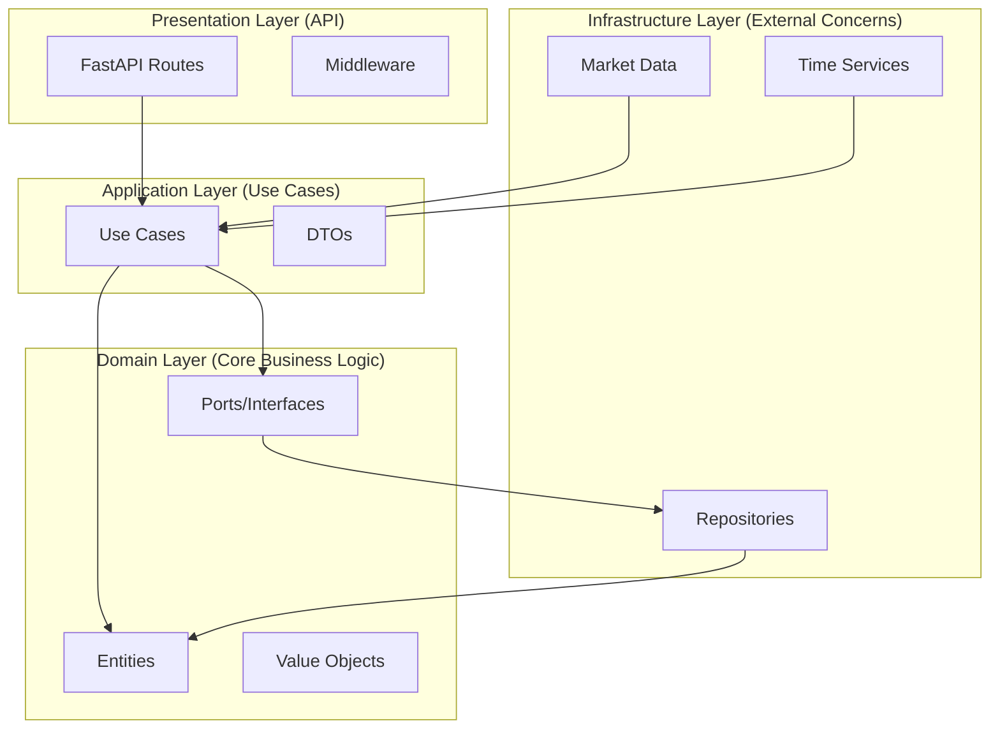

# Volatility Balancing — Architecture v1 (MVP)

> Semi‑passive, rules‑based trading for blue‑chip equities with transparent guardrails and full auditability.

---

## 1) TL;DR

- **Frontend:** React + TypeScript, Vite, Tailwind CSS, Recharts, React Query, React Router
- **Backend:** Python **FastAPI** with Clean Architecture (Domain-Driven Design)
- **Data:** SQLite (development) / PostgreSQL (production), Redis for caching and idempotency
- **Architecture:** Hexagonal Architecture with dependency injection, event-driven design
- **Integrations:** YFinance for market data, pluggable brokerage adapters
- **Security:** Idempotency keys, request validation, audit trails

---

## 2) Component Model



---

## 3) Core Sequence (Tick → Trade)



---

## 4) Order Lifecycle (State Machine)



---

## 5) Data Model (Current Implementation)

- **positions**(id, ticker, qty, cash, anchor_price, dividend_receivable, withholding_tax_rate, created_at, updated_at)
- **orders**(id, position_id, side, qty, status, idempotency_key, request_signature, created_at, updated_at)
- **events**(id, position_id, type, inputs, outputs, message, ts)
- **dividends**(id, ticker, ex_date, pay_date, dps, currency, withholding_tax_rate, created_at)
- **dividend_receivables**(id, position_id, dividend_id, amount, status, created_at)

**Notes**

- Event store is append‑only; derive metrics & timeline from events
- Dividend receivable is included in effective cash for sizing/guardrails
- Idempotency keys prevent duplicate orders

---

## 6) APIs (Current Implementation)

- `GET /v1/healthz` → Health check
- `GET /v1/positions` → List all positions
- `POST /v1/positions` → Create new position
- `GET /v1/positions/{id}` → Get position details
- `POST /v1/positions/{id}/anchor` → Set anchor price
- `POST /v1/positions/{id}/evaluate` → Evaluate position with current price
- `POST /v1/positions/{id}/orders` → Submit order
- `POST /v1/orders/{id}/fill` → Fill order (broker callback)
- `GET /v1/dividends` → List dividends
- `POST /v1/dividends/announce` → Announce dividend
- `POST /v1/dividends/pay` → Process dividend payment

---

## 7) Domain Model (UML)

```mermaid
classDiagram
  class Position {
    +String id
    +String ticker
    +Float qty
    +Float cash
    +Float anchor_price
    +Float dividend_receivable
    +Float withholding_tax_rate
    +GuardrailPolicy guardrails
    +OrderPolicy order_policy
    +DateTime created_at
    +DateTime updated_at
    +set_anchor_price(price)
    +get_effective_cash()
    +adjust_anchor_for_dividend(dps)
  }

  class Order {
    +String id
    +String position_id
    +OrderSide side
    +Float qty
    +String status
    +String idempotency_key
    +DateTime created_at
    +DateTime updated_at
  }

  class Event {
    +String id
    +String position_id
    +String type
    +Dict inputs
    +Dict outputs
    +String message
    +DateTime ts
  }

  class Dividend {
    +String id
    +String ticker
    +DateTime ex_date
    +DateTime pay_date
    +Decimal dps
    +String currency
    +Float withholding_tax_rate
    +calculate_gross_amount(shares)
    +calculate_net_amount(shares)
  }

  class GuardrailPolicy {
    +Float min_qty
    +Float min_notional
    +Float lot_size
    +Float qty_step
    +ActionBelowMin action_below_min
  }

  class OrderPolicy {
    +Float trigger_threshold_pct
    +Float rebalance_ratio
    +Float commission_rate
    +Boolean allow_after_hours
  }

  Position ||--o{ Order : has
  Position ||--o{ Event : generates
  Position ||--o{ DividendReceivable : has
  Position ||--|| GuardrailPolicy : uses
  Position ||--|| OrderPolicy : uses
  Dividend ||--o{ DividendReceivable : creates
```

---

## 8) Clean Architecture Layers



---

## 9) Technology Stack

- **Frontend:** React 18, TypeScript, Vite, Tailwind CSS, Recharts, React Query, React Router
- **Backend:** Python 3.11+, FastAPI, Pydantic, SQLAlchemy
- **Database:** SQLite (dev), PostgreSQL (prod)
- **Cache:** Redis
- **Market Data:** YFinance
- **Architecture:** Clean Architecture / Hexagonal Architecture
- **Testing:** Pytest, FastAPI TestClient
- **Documentation:** OpenAPI 3.0, Mermaid diagrams

---

## 10) Security & Compliance

- Request validation via Pydantic models
- Idempotency keys for order deduplication
- Input sanitization and type checking
- Audit trails via event store
- No PII storage beyond configuration

---

## 11) Deployment & Development

- **Development:** Local SQLite, in-memory repositories
- **Production:** PostgreSQL, Redis, containerized deployment
- **Configuration:** Environment variables for persistence backends
- **Testing:** Unit tests, integration tests, API tests

---

## 12) Observability

- Structured logging with request IDs
- Event store for audit trails
- Health check endpoints
- Error handling and validation

---

## 13) Future Enhancements

- Multi-asset portfolio allocation
- Dynamic thresholds
- DRIP (Dividend Reinvestment Plan)
- TWAP (Time-Weighted Average Price)
- Tax-lot optimization
- Real-time WebSocket updates
- Advanced analytics and reporting
