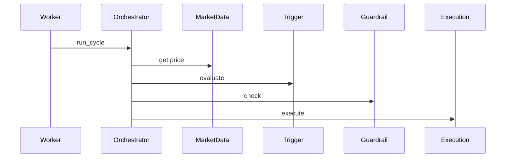

```mermaid
sequenceDiagram
  participant W as Worker
  participant O as Orchestrator
  participant MD as MarketData
  participant TR as Trigger
  participant GR as Guardrail
  participant EX as Execution

  W->>O: run_cycle
  O->>MD: get price
  O->>TR: evaluate
  O->>GR: check
  O->>EX: execute
```
