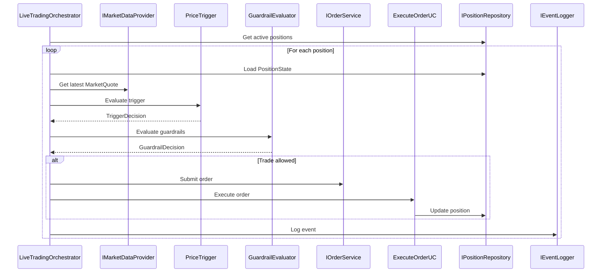

# Architecture Overview Review

**File**: `docs/architecture/ARCHITECTURE_OVERVIEW.md`  
**Date**: January 2025  
**Reviewer**: AI Assistant

---

## ✅ **Strengths**

1. **Clear Vision & Mission**: Well-articulated business purpose
2. **Event-Driven Focus**: Correctly emphasizes event-driven architecture
3. **State Model Clarity**: The three-domain state model (Positions, Config, Event Log) is clear and correct
4. **Tenancy Model**: Good explanation of multi-tenant support
5. **Architectural Principles**: Solid principles listed

---

## ⚠️ **Issues & Recommendations**

### 1. **Service Names Don't Match Implementation**

**Current Document Says:**
- `PriceFetcher`
- `VolatilitySignalService`
- `AllocationGuardrailService`
- `RebalanceOrderService`
- `ExecutionListener`
- `PositionService`
- `CorporateActionsService`
- `NotificationService`
- `AnalyticsService`
- `SimulationService`

**Actual Implementation Has:**
- `LiveTradingOrchestrator` / `SimulationOrchestrator` (orchestration layer)
- `PriceTrigger` / `GuardrailEvaluator` (domain services)
- `EvaluatePositionUC` (use case)
- `SubmitOrderUC` / `ExecuteOrderUC` (use cases)
- `ProcessDividendUC` (use case)
- `IMarketDataProvider` (port/adapter)
- `IOrderService` (port/adapter)
- `IPositionRepository` (port/adapter)
- `ContinuousTradingService` (application service)

**Recommendation**: Update service names to match the actual clean architecture implementation, or add a mapping section explaining the conceptual vs. implementation names.

---

### 2. **Missing Clean Architecture Layer Details**

The document describes an event-driven architecture but doesn't mention:
- **Domain Layer**: Pure business logic (PriceTrigger, GuardrailEvaluator)
- **Application Layer**: Orchestrators, Use Cases, Ports
- **Infrastructure Layer**: Adapters, Repositories

**Recommendation**: Add a section explaining how the event-driven model maps to the clean architecture layers, or reference `clean_architecture_overview.md`.

---

### 3. **Event Flow Doesn't Match Current Implementation**

**Current Document Flow:**
```
PriceFetcher → VolatilitySignalService → AllocationGuardrailService → 
RebalanceOrderService → ExecutionListener → PositionService → 
CorporateActionsService → NotificationService → AnalyticsService
```

**Actual Implementation Flow:**
```
LiveTradingOrchestrator.run_cycle():
  1. Load PositionState (via IPositionRepository)
  2. Fetch MarketQuote (via IMarketDataProvider)
  3. Evaluate Trigger (PriceTrigger.evaluate() - domain service)
  4. Evaluate Guardrails (GuardrailEvaluator.evaluate() - domain service)
  5. Submit Order (via IOrderService)
  6. Execute Order (ExecuteOrderUC)
  7. Update Position (via repository)
  8. Log Events (via IEventLogger)
```

**Recommendation**: Update the event flow to reflect the actual orchestrator-based implementation, or clarify that this is a "target architecture" vs. "current implementation."

---

### 4. **Missing Key Implementation Details**

The document doesn't mention:
- **Orchestrators**: `LiveTradingOrchestrator`, `SimulationOrchestrator`
- **Domain Services**: `PriceTrigger`, `GuardrailEvaluator` (pure functions)
- **Value Objects**: `MarketQuote`, `PositionState`, `TriggerConfig`, `GuardrailDecision`, `TradeIntent`
- **Ports/Adapters Pattern**: How external dependencies are abstracted
- **Dependency Injection**: How services are wired together

**Recommendation**: Add a section on "Current Implementation Architecture" or link to `clean_architecture_overview.md` and `ARCHITECTURE_CLEANUP.md`.

---

### 5. **Commission & Dividend Handling**

The document mentions:
- "Embeds commission rate snapshot" in RebalanceOrderService
- "Writes commissions" in ExecutionListener
- "Updates positions, cash, cost basis, commissions, dividends" in PositionService

**This is correct!** But could be more explicit about:
- Commission rates come from Config Store
- Commission snapshots in Orders
- Commission tracking in Trades
- Aggregates in Positions (`total_commission_paid`, `total_dividends_received`)

**Recommendation**: Add a brief section on "Financial Tracking" explaining how commissions and dividends flow through the system.

---

### 6. **Simulation Architecture**

The document says:
> "Simulation is read-only on production data — never modifies Orders, Executions, Positions, or Dividends."

**This is correct!** But should mention:
- `SimulationOrchestrator` uses `ISimulationOrderService` and `ISimulationPositionRepository`
- Simulation writes to separate simulation tables/results
- Historical data replay via `IHistoricalPriceProvider`

**Recommendation**: Expand the Simulation section to explain how simulation isolation is achieved.

---

### 7. **Formatting & Structure**

**Issues:**
- Missing markdown headers (should use `#`, `##`, `###`)
- No front-matter (owner, status, last_updated)
- Bullet points not consistently formatted
- Could use Mermaid diagrams for event flow

**Recommendation**: 
- Add proper markdown headers
- Add front-matter following the docs template
- Add a Mermaid sequence diagram for the event flow
- Consider adding a "Current vs. Target Architecture" section

---

## 📝 **Suggested Additions**

### 1. **Add a "Current Implementation" Section**

```markdown
## 2.1 Current Implementation

The system currently implements a clean architecture with:

- **Domain Layer**: Pure business logic (PriceTrigger, GuardrailEvaluator)
- **Application Layer**: Orchestrators (LiveTradingOrchestrator, SimulationOrchestrator)
- **Infrastructure Layer**: Adapters implementing ports (YFinance, SQL repositories)

See [Clean Architecture Overview](clean_architecture_overview.md) for details.
```

### 2. **Add a "Service Mapping" Section**

```markdown
## Service Mapping: Conceptual vs. Implementation

| Conceptual Service | Implementation |
|-------------------|----------------|
| PriceFetcher | IMarketDataProvider (adapter) |
| VolatilitySignalService | PriceTrigger (domain service) |
| AllocationGuardrailService | GuardrailEvaluator (domain service) |
| RebalanceOrderService | SubmitOrderUC (use case) |
| ExecutionListener | ExecuteOrderUC (use case) |
| PositionService | IPositionRepository (adapter) |
| CorporateActionsService | ProcessDividendUC (use case) |
| SimulationService | SimulationOrchestrator |
```

### 3. **Add a Mermaid Diagram**



---

## 🎯 **Overall Assessment**

**Score: 7/10**

**Strengths:**
- Clear vision and mission
- Good high-level architecture description
- Correct state model
- Good tenancy explanation

**Weaknesses:**
- Service names don't match implementation
- Missing clean architecture details
- Event flow doesn't match current code
- Needs better formatting

**Recommendation**: 
1. **Option A (Quick Fix)**: Add a "Current Implementation" section that maps conceptual services to actual code
2. **Option B (Better)**: Rewrite to match actual implementation while keeping the vision/mission
3. **Option C (Best)**: Keep as "Target Architecture" and create a separate "Current Implementation" document

---

## ✅ **Action Items**

1. ✅ Add markdown headers
2. ✅ Add front-matter
3. ✅ Update service names or add mapping section
4. ✅ Add clean architecture layer explanation
5. ✅ Update event flow to match implementation
6. ✅ Add Mermaid diagram
7. ✅ Link to other architecture docs
8. ✅ Add commission/dividend flow details

---

**Last Updated**: January 2025


