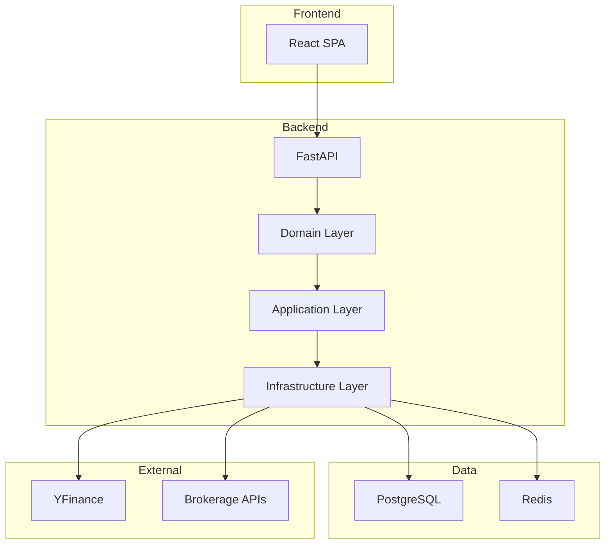

# Volatility Balancing Documentation

Welcome to the comprehensive documentation for the Volatility Balancing trading system.

## 🎯 System Overview

Volatility Balancing is a semi-passive trading platform designed for blue-chip equities with transparent guardrails and full auditability. The system implements a rules-based approach to volatility trading with comprehensive position management, order execution, and dividend processing capabilities.

## 📋 Documentation Structure

### Architecture Documentation

- **[System Architecture v1](architecture/system_architecture_v1.md)** - Complete system overview with current implementation details
- **[Component Architecture](architecture/component_architecture.md)** - Detailed component relationships and dependencies
- **[Deployment Architecture](architecture/deployment_architecture.md)** - Infrastructure, containerization, and deployment strategies
- **[Sequence Diagrams](architecture/SEQUENCE_EXAMPLE.md)** - Comprehensive API flow documentation

### API Documentation

- **[OpenAPI Specification](api/openapi.yaml)** - Complete REST API documentation
- **[API Guide](api/OPENAPI_README.md)** - API governance and usage guidelines

### Development Documentation

- **[Developer Notes](DEVELOPER_NOTES.md)** - Development guidelines and best practices
- **[Migration Guide](MIGRATION.md)** - System migration and upgrade procedures
- **[Test Plan](dev/test-plan.md)** - Testing strategy and procedures
- **[CI/CD Guide](dev/ci-cd.md)** - Continuous integration and deployment

### Product Documentation

- **[Product Requirements](product/volatility_trading_spec_v1.md)** - Product specification and requirements
- **[Architecture Decision Records](adr/)** - Key architectural decisions and rationale

## 🚀 Quick Start

### Prerequisites

- Node.js 18+ and npm
- Python 3.11+
- PostgreSQL (for production)
- Redis (optional, for caching)

### Development Setup

```bash
# Clone repository
git clone <repository-url>
cd Volatility-Balancing

# Backend setup
cd backend
python -m venv .venv
source .venv/bin/activate
pip install -e ".[dev]"
python -m uvicorn app.main:app --reload

# Frontend setup (new terminal)
cd frontend
npm install
npm run dev

# Access application
open http://localhost:3000
```

## 🏗️ Architecture Highlights

### Clean Architecture Implementation

- **Domain Layer**: Pure business logic with no external dependencies
- **Application Layer**: Use cases and application services
- **Infrastructure Layer**: External concerns (database, APIs, frameworks)
- **Presentation Layer**: FastAPI routes and React components

### Key Features

- **Volatility Trading**: Automated buy/sell signals based on price thresholds
- **Position Management**: Comprehensive position tracking with anchor prices
- **Order Execution**: Idempotent order submission with broker integration
- **Dividend Processing**: Automated dividend announcement and payment handling
- **Audit Trails**: Complete event logging for compliance and debugging
- **Real-time Updates**: Live market data integration and position updates

### Technology Stack

- **Frontend**: React 18, TypeScript, Vite, Tailwind CSS, React Query
- **Backend**: Python FastAPI, Pydantic, SQLAlchemy, Clean Architecture
- **Database**: PostgreSQL (production), SQLite (development)
- **Cache**: Redis for idempotency and performance
- **Market Data**: YFinance integration
- **Testing**: Pytest, React Testing Library, comprehensive test coverage

## 📊 System Diagrams

### High-Level Architecture



## 🔧 Development Guidelines

### Code Organization

- Follow Clean Architecture principles
- Use dependency injection for testability
- Implement comprehensive error handling
- Write tests for all business logic
- Document all public APIs

### Testing Strategy

- Unit tests for domain logic
- Integration tests for use cases
- API tests for endpoints
- Frontend component tests
- End-to-end tests for critical flows

### Code Quality

- Type hints for all Python code
- TypeScript for all frontend code
- Linting with ruff and ESLint
- Formatting with black and Prettier
- Static analysis with mypy

## 📈 Monitoring and Observability

### Logging

- Structured JSON logging
- Request/response correlation IDs
- Error tracking and alerting
- Performance metrics

### Metrics

- Trading performance metrics
- System health indicators
- Error rates and response times
- Business KPIs

## 🔒 Security Considerations

### Data Protection

- Encryption at rest and in transit
- Secure secrets management
- Input validation and sanitization
- Audit logging for compliance

### Access Control

- API authentication and authorization
- Role-based access control
- Idempotency for order safety
- Rate limiting and DDoS protection

## 📚 Additional Resources

- **[GitHub Repository](https://github.com/your-org/volatility-balancing)** - Source code and issue tracking
- **[API Documentation](http://localhost:8000/docs)** - Interactive API documentation (when running)
- **[Architecture Decision Records](adr/)** - Key decisions and rationale
- **[Contributing Guidelines](CONTRIBUTING.md)** - How to contribute to the project

## 🤝 Support

For questions, issues, or contributions:

- Create an issue in the GitHub repository
- Review the architecture documentation
- Check the developer notes for common issues
- Consult the API documentation for integration help

---

_Last updated: January 2025_
